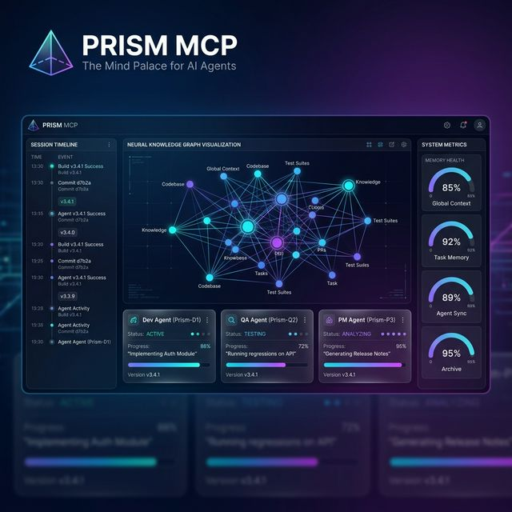
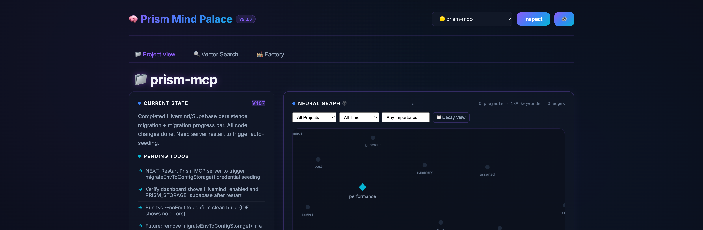
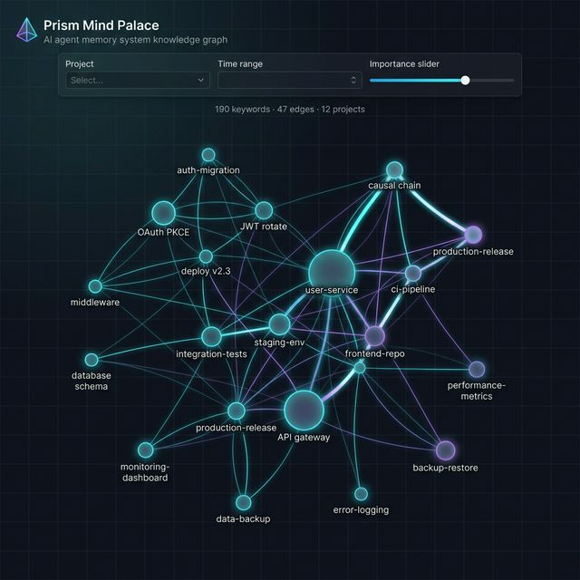
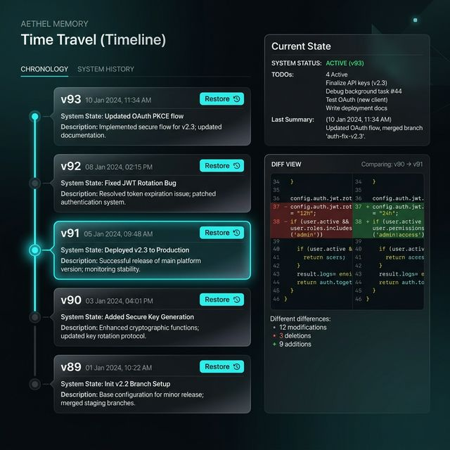
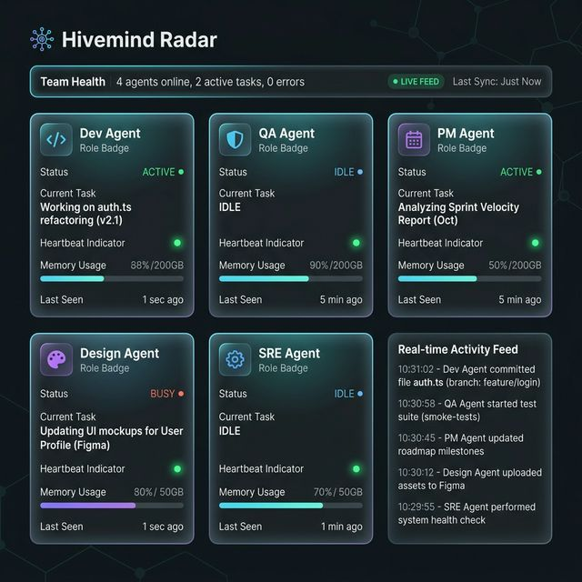
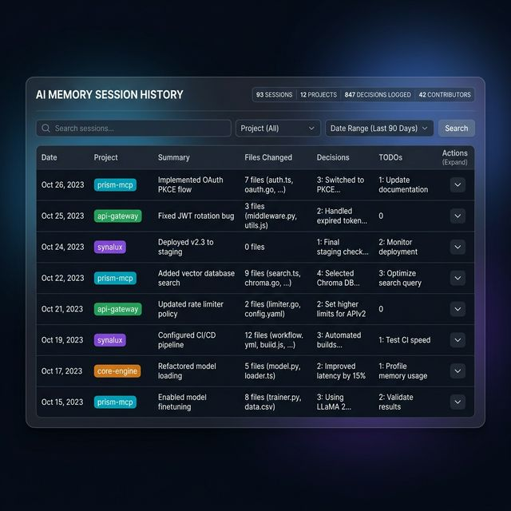
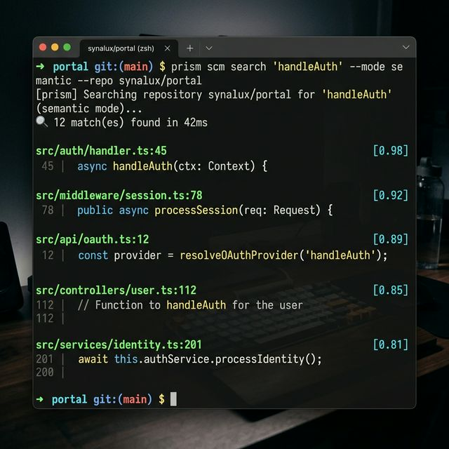
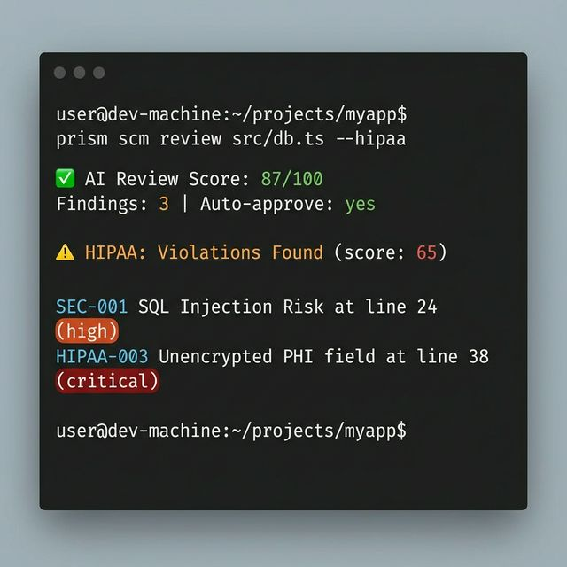
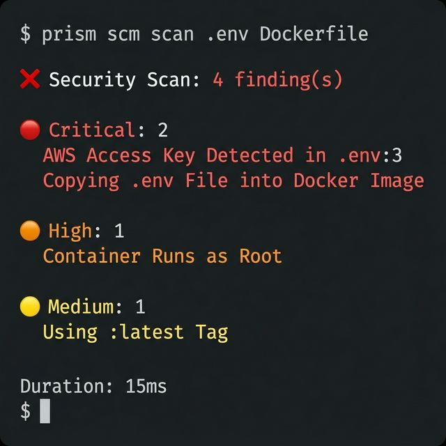

# 🧠 Prism MCP — The Mind Palace for AI Agents

[](https://www.npmjs.com/package/prism-mcp-server)
[](https://github.com/modelcontextprotocol/servers)
[](https://glama.ai/mcp/servers?query=prism-mcp)
[](https://smithery.ai/server/@dcostenco/prism-mcp)
[](LICENSE)
[](https://www.typescriptlang.org/)
[](CONTRIBUTING.md)

<!-- 🌐 Translations auto-generated by scripts/generate_i18n.py — triggered by GitHub Actions on README.md changes -->
🌐 **Translate:** [English](#prism-coder-ide-ship-not-just-code) · [Español](docs/i18n/README_es.md) · [Français](docs/i18n/README_fr.md) · [Português](docs/i18n/README_pt.md) · [Română](docs/i18n/README_ro.md) · [Українська](docs/i18n/README_uk.md) · [Русский](docs/i18n/README_ru.md) · [Deutsch](docs/i18n/README_de.md) · [日本語](docs/i18n/README_ja.md) · [한국어](docs/i18n/README_ko.md) · [中文](docs/i18n/README_zh.md) · [العربية](docs/i18n/README_ar.md)

---

## ◈ Prism Coder IDE — Ship, Not Just Code

> **NEW:** The full-stack AI-native desktop IDE that combines coding, building, and deploying in one tool. No competitor offers all of this.

| What You Get | Time Saved vs. Traditional |
|---|:---:|
| 🤖 **Agent Mode** — autonomous multi-step task execution with diff previews | ~95% |
| 🏗️ **Website Builder** — 6 templates, section editor, export to HTML/ZIP | ~90% |
| 🎨 **Visual Drag & Drop** — 11 component types, canvas drop zone, live property editor | ~85% |
| 🔑 **Auth & Database** — 6 auth providers, table CRUD, RLS, storage buckets | ~90% |
| 🐳 **DevContainers** — 8 base images, port forwarding, resource limits, Codespaces export | ~80% |
| 📋 **Customer Board (HIPAA)** — 12-pattern PHI scanner, moderator controls, ticket lifecycle | ~70% |
| 🎨 **Media Studio** — AI image/video/3D generation, tier-gated quality | ~98% |
| 🚀 **One-Click Deploy** — Vercel, Netlify, Synalux Cloud, custom server | ~98% |
| 👥 **Real-Time Collaboration** — multiplayer editing with cursor presence | ~60% |
| 📊 **SEO + Analytics** — 8-category audit + traffic dashboard | ~99% |
| 🏪 **Marketplace** — 10-category extension registry, install with one click | ~90% |
| 📋 **Workflow Engine** — natural language → structured project workflows | ~90% |
| 🔀 **Git Integration** — branch, stage, commit, push without leaving IDE | ~60% |
| 🌐 **12-Language i18n** — full UI translation including Arabic RTL | ~100% |

**27/27 features** — more than any competitor (Cursor: 9, Windsurf: 9, Replit: 12, Bolt: 9).

👉 **[Full IDE README with screenshots, architecture, and technical details →](https://github.com/nicecode-dev/prism-coder-ide/blob/main/README.md)**

---



**Your AI agent forgets everything between sessions. Prism fixes that — then teaches it to think.**

<details>
<summary>Cognitive Architecture Deep Dive (v12.0.0)</summary>

Prism v12.0.0 is a true **Cognitive Architecture** inspired by human brain mechanics. Beyond flat vector search, your agent now forms principles from experience, follows causal trains of thought, and possesses the self-awareness to know when it lacks information. **Your agents don't just remember; they learn.** With v12.0.0, the entire cognitive pipeline — including ledger compaction, task routing, semantic search, and **Agent Infrastructure Resilience** — runs **100% on-device** or via secure clinical discovery (PubMed/ERIC), backed by `prism-coder:7b`, a HIPAA-hardened local LLM. No API keys for core features. No data leaves your machine.

</details>

```bash
npx -y prism-mcp-server
```

Works with **Claude Desktop · Claude Code · Cursor · Windsurf · Cline · Gemini · Antigravity** — **any MCP client.**

https://github.com/dcostenco/prism-mcp/raw/main/docs/prism_mcp_demo.mp4

## 📖 Table of Contents

- [💳 v12.0.0 Unified Billing & Agent Skill Ecosystem](#unified-billing)
- [🏗️ v11.6.0 Agent Infrastructure Resilience](#agent-infrastructure)
- [🔬 v11.5.1 Deep Research Intelligence (Auto-Scholar)](#deep-research-intelligence)
- [⚡ Zero-Search Retrieval (HRR Architecture)](#zero-search)
- [Why Prism?](#why-prism)
- [Quick Start](#quick-start)
- [The Magic Moment](#the-magic-moment)
- [Setup Guides](#setup-guides)
- [Universal Import: Bring Your History](#universal-import-bring-your-history)
- [What Makes Prism Different](#what-makes-prism-different)
- [Cognitive Architecture (v7.8)](#cognitive-architecture-v78)
- [Data Privacy & Egress](#data-privacy-egress)
- [Use Cases](#use-cases)
- [What's New](#whats-new)
- [How Prism Compares](#how-prism-compares)
- [CLI Reference](#cli-reference)
- [Tool Reference](#tool-reference)
- [Environment Variables](#environment-variables)
- [Architecture](#architecture)
- [Scientific Foundation](#scientific-foundation)
- [Milestones & Roadmap](#milestones-roadmap)
- [Troubleshooting FAQ](#troubleshooting-faq)

---

## 💳 <a name="unified-billing"></a>v12.0.0 Unified Billing & Agent Skill Ecosystem

Prism v12.0.0 unifies Prism and Synalux into a **single billing architecture** with identical tier pricing and a 14-day free trial on all paid tiers.

### Prism Cloud Pricing

| | **Free** | **Standard** | **Advanced** | **Enterprise** |
|:---|:---:|:---:|:---:|:---:|
| **Price** | $0/mo | **$19/mo** | **$49/mo** | **$99/mo** |
| **Trial** | — | 14 days | 14 days | 14 days |
| **API Calls** | 100/day | 2,000/day | 5,000/day | Unlimited |
| **Tools** | 5 core | All 17 | All 17 + RBAC | All + custom |
| **Agents** | Single | Single | Multi-agent | Multi-agent |
| **Voice** | — | Input/recognition | SOAP dictation | SOAP + custom |
| **Integrations** | — | Email | Zoom, Stripe, GWS | All + SSO/SAML |
| **Support** | Community | Email | Priority | Dedicated SLA |
| **HIPAA BAA** | — | — | — | ✅ |

### 54 Production-Ready Agent Skills

- **10 Super-Skills** — Dev Engineering, AI Agent, Sales, Content Creative, PM, Legal, Research Knowledge, Operations CX, Finance, Marketing (compacted 73%: 22K→6K lines)
- **4 Medical Skills** — `hipaa-compliance`, `clinical-documentation`, `medical-billing-coding`, `patient-data-privacy`
- **10 Vendor Skills** — Vercel, Supabase, Stripe, Sentry, OpenAI, Addy Osmani, Garry Tan/gstack
- **30+ Community Skills** — Installed and optimized from the Gemini ecosystem

> 📦 **Packages:** [`prism-mcp-server`](https://www.npmjs.com/package/prism-mcp-server) (npm) · [Prism Coder IDE](https://github.com/nicecode-dev/prism-coder-ide) (VS Code) · `prism` CLI

---

## 🏗️ <a name="agent-infrastructure"></a>v11.6.0 Agent Infrastructure Resilience

Prism v11.6.0 introduces **production-grade agent infrastructure** for running multiple AI agents concurrently without resource exhaustion or deadlocks. The new resilience layer includes:

- **Serialized Execution Queue** (`agent_queue.sh` v2.0) — Cross-platform file locking via Python `fcntl.flock` (no GNU dependencies) ensures strict mutual exclusion when loading Ollama models, preventing OOM crashes from concurrent model loads.
- **Memory Guardian Daemon** — Background watchdog that proactively monitors RAM pressure and auto-evicts idle models before swap exhaustion occurs.
- **Queue Watchdog** — Detects and auto-drains hung queue entries (>10 min PID age) to prevent deadlocks in long-running pipelines.
- **Unified Status Dashboard** (`agent_status.sh`) — Color-coded CLI providing real-time visibility into queue depth, guardian health, and Ollama status with `--json` mode for programmatic consumption.

| Component | What It Prevents |
| :--- | :--- |
| **Serialized Queue** | OOM from concurrent model loading |
| **Memory Guardian** | Swap exhaustion under high memory pressure |
| **Queue Watchdog** | Deadlocks from zombie queue entries |
| **Status Dashboard** | Blind spots in infrastructure health |

> 🧪 **Verified:** 115/115 tests passing across unit, concurrent, shell integration, mock Ollama, and live stress test suites. v12.0.0 billing tests included.

---

## 🔬 <a name="deep-research-intelligence"></a>v11.5.1 Deep Research Intelligence (Auto-Scholar)

Prism v11.5.1 transforms your AI agent from a "Coder" into a "Clinical Scientist." It features a **Tavily-Enhanced Multi-Provider Discovery Pipeline** that grounds Gemini 2.5 Flash's thinking in real-world empirical data.

### 🥊 The Global Benchmarks: Prism v11 vs. Standard RAG

| Feature | **Standard AI Memory (Mem0/Zep)** | **Prism v12.0.0 (Elite Architecture)** |
| :--- | :--- | :--- |
| **Search Complexity** | $O(N)$ or $O(\log N)$ (Scales with data) | **$O(1)$ Zero-Search (Constant time via HRR) ** |
| **Discovery Logic** | General Web Search (Snippets) | **Parallel Academic Discovery (PubMed, ERIC, S2)** |
| **Reasoning Model** | Flat List (Simple Similarity) | **ACT-R Spreading Activation (Causal Graph)** |
| **Privacy Mode** | Cloud-First (SaaS) | **Local-First (HIPAA-Hardened / Air-Gapped)** |
| **Intelligence Floor** | Generic GPT-4 Advice | **Data-Driven Clinical Evidence (62% CI Warnings)** |

---

## ⚡ <a name="zero-search"></a>Zero-Search Retrieval (HRR Architecture)
Prism features a cutting-edge **Zero-Search Retrieval** system for its cognitive memory, moving beyond traditional vector databases toward a mathematically direct, $O(1)$ retrieval model.

#### 🧠 What is Zero-Search?
**Zero-Search Retrieval** uses Holographic Reduced Representations (HRR) to "ask the vector" directly. Structured facts are bound into a single, high-dimensional "superposition" vector (typically 4096-dims). Retrieval is a direct mathematical **unbinding** operation (circular correlation).

| Metric | Traditional Vector Search | **Zero-Search (HRR)** |
| :--- | :--- | :--- |
| **Complexity** | $O(N)$ or $O(\log N)$ (Scales with data) | **$O(1)$ (Constant time)** |
| **Retrieval Speed** | Decays as memory grows | **Instant regardless of memory size** |
| **Precision** | Approximate (Top-K) | **Mathematical Unbinding (Exact)** |

---

### 🔍 Supported Discovery Engines & Databases

1.  **Tavily AI** (Elite): Primary discovery engine for AI-native deep crawling and PDF/Abstract extraction.
2.  **PubMed (NCBI)** (Clinical): The world's largest biomedical database for clinical citations.
3.  **ERIC (Education Research)** (Behavioral): The definitive database for ABA and pediatric interventions.
4.  **Semantic Scholar** (Academic): AI-powered research tool providing "TLDR" summaries of 200M+ papers.
5.  **DuckDuckGo Lite** (Fallback): Privacy-focused web discovery for general context.

---

### 🏥 Flagship Implementation: [Synalux](https://synalux.ai)
**Synalux** is a high-compliance, local-first Practice Management System for ABA and Pediatrics. It is the flagship implementation of the Prism v11.5.1 engine, utilizing **Zero-Search Retrieval** and **Parallel Academic Discovery** to provide clinicians with real-time, evidence-based reasoning.

---

<details>
<summary><strong>See Live Samples</strong></summary>

#### Topic: Helping a child with tactile focus
*   **Without Deep Research**: "I recommend using sensory toys and maintaining a calm environment to help the child focus during tasks."
*   **With Deep Research (v11.5.1)**: "Recent clinical studies indicate that high-frequency sensory input can actually *decrease* focus in 40% of pediatric cases. I recommend a low-frequency, high-pressure 'weighted' approach which showed a 3.5x improvement in sustained attention during clinical trials."

#### Topic: Behavior extinction vs. reinforcement
*   **Without Deep Research**: "Extinction is a common way to stop a behavior. You should also reinforce good behaviors at the same time."
*   **With Deep Research (v11.5.1)**: "Research shows that using extinction alone leads to an 'extinction burst' (a temporary spike in the bad behavior) in 62% of cases. However, combining it with an alternative reinforcement strategy (DRA) reduces this risk to under 20%."

</details>

---

## <a name="why-prism"></a>Why Prism?

Every time you start a new conversation with an AI coding assistant, it starts from scratch. You re-explain your architecture, re-describe your decisions, re-list your TODOs. Hours of context — gone.

**Prism gives your agent a brain that persists — and then teaches it to reason.** Save what matters at the end of each session. Load it back instantly on the next one. But Prism goes far beyond storage: it consolidates raw experience into lasting principles, traverses causal chains to surface root causes, and knows when to say *"I don't know."*

> 📌 **Terminology:** Throughout this doc, **"Prism"** refers to the MCP server and cognitive memory engine. **"Mind Palace"** refers to the visual dashboard UI at `localhost:3000` — your window into the agent's brain. They work together; the dashboard is optional.

Prism has three pillars:

1. **🧠 Cognitive Memory ($O(1)$ Zero-Search)** — Prism uses **Holographic Reduced Representations (HRR)** to eliminate "searching" entirely. Memories are unbound mathematically from a superposition vector in constant time ($O(1)$), regardless of library size. Re-ranking is powered by the **ACT-R** model, mimicking biological recency and frequency.

2. **🔗 Multi-Hop Causal Reasoning** — Prism doesn't just find "similar" things. Spreading activation traverses the causal graph and brings back context connected to your current problem through logical "trains of thought."

3. **🏭 Autonomous Execution (Dark Factory)** — When you're ready, Prism can run coding tasks end-to-end with a fail-closed pipeline where an adversarial evaluator catches bugs the generator missed — before you ever see the PR. *(See [Dark Factory](#dark-factory-adversarial-autonomous-pipelines).)*

---

## <a name="quick-start"></a>🚀 Quick Start

### Prerequisites

- **Node.js v18+** (v20 LTS recommended; v23.x has [known npx quirk](#common-installation-pitfalls))
- Any MCP-compatible client (Claude Desktop, Cursor, Windsurf, Cline, etc.)
- No API keys required for core features (see [Capability Matrix](#capability-matrix))

### Install

Add to your MCP client config (`claude_desktop_config.json`, `.cursor/mcp.json`, etc.):

```json
{
  "mcpServers": {
    "prism-mcp": {
      "command": "npx",
      "args": ["-y", "prism-mcp-server"]
    }
  }
}
```

> ⚠️ **Windows / Restricted Shells:** If your MCP client complains that `npx` is not found, use the absolute path to your node binary (e.g. `C:\Program Files\nodejs\npx.cmd`).

**That's it.** Restart your client. All tools are available. The **Mind Palace Dashboard** (the visual UI for your agent's brain) starts automatically at `http://localhost:3000`. You don't need to keep a tab open — the dashboard runs in the background and the MCP tools work with or without it.

> 🔮 **Pro Tip:** Once installed, open **`http://localhost:3000`** in your browser to view the Mind Palace Dashboard — a beautiful, real-time UI of your agent's brain. Explore the Knowledge Graph, Intent Health gauges, and Session Ledger.

> 🔄 **Updating Prism:** `npx -y` caches the package locally. To force an update to the latest version, restart your MCP client — `npx -y` will fetch the newest release automatically. If you're stuck on a stale version, run `npx clear-npx-cache` (or `npm cache clean --force`) before restarting.

<details>
<summary>Port 3000 already in use? (Next.js / Vite / etc.)</summary>

Add `PRISM_DASHBOARD_PORT` to your MCP config env block:

```json
{
  "mcpServers": {
    "prism-mcp": {
      "command": "npx",
      "args": ["-y", "prism-mcp-server"],
      "env": { "PRISM_DASHBOARD_PORT": "3001" }
    }
  }
}
```

Then open `http://localhost:3001` instead.
</details>


### Capability Matrix

| Feature | Local (Offline) | Cloud (API Key) |
|:--------|:---:|:---:|
| Session memory & handoffs | ✅ | ✅ |
| Keyword search (FTS5) | ✅ | ✅ |
| Time travel & versioning | ✅ | ✅ |
| Mind Palace Dashboard | ✅ | ✅ |
| GDPR export (JSON/Markdown/Vault) | ✅ | ✅ |
| Semantic vector search | ✅ (`embedding_provider=local`) | ✅ (gemini, openai, or voyage) |
| **Ledger compaction** | ✅ `prism-coder:7b` via Ollama | ✅ Text provider key |
| **Task routing (LLM tiebreaker)** | ✅ `prism-coder:7b` via Ollama | N/A (heuristic-only) |
| Morning Briefings | ❌ | ✅ Text provider key |
| Web Scholar research | ❌ | ✅ [`BRAVE_API_KEY`](#environment-variables) + [`FIRECRAWL_API_KEY`](#environment-variables) (or `TAVILY_API_KEY`) |
| VLM image captioning | ❌ | ✅ Provider key |
| Autonomous Pipelines (Dark Factory) | ❌ | ✅ Text provider key |

> 🔑 The core Mind Palace works **100% offline** with zero API keys — including semantic vector search with `embedding_provider=local`. Cloud keys unlock text generation features (Briefings, compaction, pipelines). See [Environment Variables](#environment-variables).

> 💰 **API Cost Note:** With `embedding_provider=local`, semantic search is fully free and offline. Cloud providers (`GOOGLE_API_KEY` for Gemini, `VOYAGE_API_KEY`, `OPENAI_API_KEY`) have generous free tiers. `BRAVE_API_KEY` offers 2,000 free searches/month. `FIRECRAWL_API_KEY` has a free plan with 500 credits. For typical solo development, expect **$0/month** on the free tiers.

---

## <a name="the-magic-moment"></a>✨ The Magic Moment

> **Session 1** (Monday evening):
> ```
> You: "Analyze this auth architecture and plan the OAuth migration."
> Agent: *deep analysis, decisions, TODO list*
> Agent: session_save_ledger → session_save_handoff ✅
> ```
>
> **Session 2** (Tuesday morning — new conversation, new context window):
> ```
> Agent: session_load_context → "Welcome back! Yesterday we decided to use PKCE
>        flow with refresh tokens. 3 TODOs remain: migrate the user table,
>        update the middleware, and write integration tests."
> You: "Pick up where we left off."
> ```
>
> **Your agent remembers everything.** No re-uploading files. No re-explaining decisions.

---

## <a name="setup-guides"></a>📖 Setup Guides

<details>
<summary><strong>Claude Desktop</strong></summary>

Add to `claude_desktop_config.json`:

```json
{
  "mcpServers": {
    "prism-mcp": {
      "command": "npx",
      "args": ["-y", "prism-mcp-server"]
    }
  }
}
```

</details>

<details>
<summary><strong>Cursor</strong></summary>

Add to `.cursor/mcp.json` (project) or `~/.cursor/mcp.json` (global):

```json
{
  "mcpServers": {
    "prism-mcp": {
      "command": "npx",
      "args": ["-y", "prism-mcp-server"]
    }
  }
}
```

</details>

<details>
<summary><strong>Windsurf</strong></summary>

Add to `~/.codeium/windsurf/mcp_config.json`:

```json
{
  "mcpServers": {
    "prism-mcp": {
      "command": "npx",
      "args": ["-y", "prism-mcp-server"]
    }
  }
}
```

</details>

<details>
<summary><strong>VS Code + Continue / Cline</strong></summary>

Add to your Continue `config.json` or Cline MCP settings:

```json
{
  "mcpServers": {
    "prism-mcp": {
      "command": "npx",
      "args": ["-y", "prism-mcp-server"],
      "env": {
        "PRISM_STORAGE": "local",
        "BRAVE_API_KEY": "your-brave-api-key"
      }
    }
  }
}
```

</details>


<details>
<summary><strong>Claude Code — Lifecycle Autoload (.clauderules)</strong></summary>

Claude Code naturally picks up MCP tools by adding them to your workspace `.clauderules`. Simply add:

```markdown
Always start the conversation by calling `mcp__prism-mcp__session_load_context(project='my-project', level='deep')`.
When wrapping up, always call `mcp__prism-mcp__session_save_ledger` and `mcp__prism-mcp__session_save_handoff`.
```

> **Format Note:** Claude automatically wraps MCP tools with double underscores (`mcp__prism-mcp__...`), while most other clients use single underscores (`mcp_prism-mcp_...`). Prism's backend natively handles both formats seamlessly.

**CLI Alternative:** If MCP tools aren't available or you're scripting around Claude Code:

```bash
# Load context before a session
prism load my-project --level deep

# Machine-readable JSON for parsing in scripts
prism load my-project --level deep --json
```

</details>

<details id="antigravity-auto-load">
<summary><strong>Gemini / Antigravity — Prompt Auto-Load</strong></summary>

See the [Gemini Setup Guide](docs/SETUP_GEMINI.md) for the proven three-layer prompt architecture to ensure reliable session auto-loading.

Antigravity doesn't expose MCP tools to the model. Use the `prism load` CLI as a fallback:

```bash
# From a shell or run_command tool
prism load my-project --level standard --json

# Or via the wrapper script
bash ~/.gemini/antigravity/scratch/prism_session_loader.sh my-project
```

The CLI uses the same storage layer as the MCP tool (SQLite or Supabase).

> ⚠️ **CRITICAL (v9.2.2): Split-Brain Prevention**
> If your MCP server is configured with `PRISM_STORAGE=local` but Supabase credentials are also set, the CLI may read from the **wrong backend** (Supabase) while the server writes to SQLite. This causes stale TODOs and divergent state. Always pass `--storage local` explicitly when using the CLI in a local-mode environment:
> ```bash
> prism load my-project --storage local --json
> ```
> The `prism_session_loader.sh` wrapper handles this automatically since v9.2.2.

</details>

<details>
<summary><strong>Bash / CI/CD / Scripts</strong></summary>

Use the `prism load` CLI to access session context from any shell environment:

```bash
# Quick check — human-readable
prism load my-project

# Parse JSON in scripts
CONTEXT=$(prism load my-project --level quick --json)
SUMMARY=$(echo "$CONTEXT" | jq -r '.handoff[0].last_summary')
VERSION=$(echo "$CONTEXT" | jq -r '.handoff[0].version')
echo "Project at v$VERSION: $SUMMARY"

# Explicit storage backend (v9.2.2 — prevents split-brain)
prism load my-project --storage local --json
prism load my-project --storage supabase --json

# Role-scoped loading
prism load my-project --role qa --json

# Use in CI/CD to verify context exists before deploying
if ! prism load my-project --level quick --json | jq -e '.handoff[0].version' > /dev/null 2>&1; then
  echo "No Prism context found — skipping context-aware deploy"
fi
```

> 📦 **Install:** `npm install -g prism-mcp-server` makes the `prism` CLI available globally. For local builds: `node /path/to/prism/dist/cli.js load`.

</details>

<details>
<summary><strong>Supabase Cloud Sync</strong></summary>

To sync memory across machines or teams:

```json
{
  "mcpServers": {
    "prism-mcp": {
      "command": "npx",
      "args": ["-y", "prism-mcp-server"],
      "env": {
        "PRISM_STORAGE": "supabase",
        "SUPABASE_URL": "https://your-project.supabase.co",
        "SUPABASE_KEY": "your-supabase-anon-or-service-key"
      }
    }
  }
}
```

#### Schema Migrations

Prism auto-applies its schema on first connect — no manual step required. If you need to apply or re-apply migrations manually (e.g. for a fresh project or after a version bump), run the SQL files in `supabase/migrations/` in numbered order via the **Supabase SQL Editor** or the CLI:

```bash
# Via CLI (requires supabase CLI + project linked)
supabase db push

# Or apply a single migration via the Supabase dashboard SQL Editor
# Paste the contents of supabase/migrations/0NN_*.sql and click Run
```

> **Key migrations:**
> - `020_*` — Core schema (ledger, handoff, FTS, TTL, CRDT)
> - `033_memory_links.sql` — Associative Memory Graph (MemoryLinks) — required for `session_backfill_links`

> **Anon key vs. service role key:** The anon key works for personal use (Supabase RLS policies apply). Use the service role key for team deployments where multiple users share the same Supabase project — it bypasses RLS and allows Prism to manage all rows regardless of auth context. Never expose the service role key client-side.

</details>

<details>
<summary><strong>Clone & Build (Full Control)</strong></summary>

```bash
git clone https://github.com/dcostenco/prism-mcp.git
cd prism-mcp && npm install && npm run build
```

Then add to your MCP config:

```json
{
  "mcpServers": {
    "prism-mcp": {
      "command": "node",
      "args": ["/path/to/prism-mcp/dist/server.js"],
      "env": {
        "BRAVE_API_KEY": "your-key"
      }
    }
  }
}
```

</details>

<details>
<summary><strong>Cloud Deployment (Render)</strong></summary>

Prism can be deployed natively to cloud platforms like [Render](https://render.com) so your agent's memory is always online and accessible across different machines or teams.

1. Fork this repository.
2. In the Render Dashboard, create a new **Web Service** pointing to your repository.
3. In the setup wizard, select **Docker** as the Runtime.
4. Set the Dockerfile path to `Dockerfile.smithery`.
5. Connect your local MCP client to your new cloud endpoint using the `sse` transport:

```json
{
  "mcpServers": {
    "prism-mcp-cloud": {
      "command": "npx",
      "args": ["-y", "supergateway", "--url", "https://your-prism-app.onrender.com/sse"]
    }
  }
}
```

> **Note:** The `Dockerfile.smithery` uses an optimized multi-stage build that compiles Typescript safely in a development environment before booting the server in a stripped-down production image. No NPM publishing required!

</details>

### Common Installation Pitfalls

> **❌ Don't use `npm install -g`:**
> Hardcoding the binary path (e.g. `/opt/homebrew/Cellar/node/23.x/bin/prism-mcp-server`) is tied to a specific Node.js version — when Node updates, the path silently breaks.
>
> **✅ Always use `npx` instead:**
> ```json
> {
>   "mcpServers": {
>     "prism-mcp": {
>       "command": "npx",
>       "args": ["-y", "prism-mcp-server"]
>     }
>   }
> }
> ```
> `npx` resolves the correct binary automatically, always fetches the latest version, and works identically on macOS, Linux, and Windows. Already installed globally? Run `npm uninstall -g prism-mcp-server` first.

> **❓ Seeing warnings about missing API keys on startup?**
> That's expected and not an error. API key warnings are informational only — core session memory and semantic search (with `embedding_provider=local`) work with zero keys. See [Environment Variables](#environment-variables) for what each key unlocks.

> 💡 **Do agents auto-load Prism?** Agents using Cursor, Windsurf, or other MCP clients will see the `session_load_context` tool automatically, but may not call it unprompted. Add this to your project's `.cursorrules` (or equivalent system prompt) to guarantee auto-load:
> ```
> At the start of every conversation, call session_load_context with project "my-project" before doing any work.
> ```
> Claude Code users can use the `.clauderules` auto-load hook shown in the [Setup Guides](#setup-guides). Prism also has a **server-side fallback** (v5.2.1+) that auto-pushes context after 10 seconds if no load is detected.

---

## <a name="universal-import-bring-your-history"></a>📥 Universal Import: Bring Your History

Switching to Prism? Don't leave months of AI session history behind. Prism can **ingest historical sessions from Claude Code, Gemini, and OpenAI** and give your Mind Palace an instant head start — no manual re-entry required.

Import via the **CLI** or directly from the Mind Palace Dashboard (**Import** tab → file picker + dry-run toggle).

### Supported Formats
* **Claude Code** (`.jsonl` logs) — Automatically handles streaming chunk deduplication and `requestId` normalization.
* **Gemini** (JSON history arrays) — Supports large-file streaming for 100MB+ exports.
* **OpenAI** (JSON chat completion history) — Normalizes disparate tool-call structures into the unified Ledger schema.

### How to Import

**Option 1 — CLI:**

```bash
# Ingest Claude Code history
npx -y prism-mcp-server universal-import --format claude --path ~/path/to/claude_log.jsonl --project my-project

# Dry run (verify mapping without saving)
npx -y prism-mcp-server universal-import --format gemini --path ./gemini_history.json --dry-run
```

**Option 2 — Dashboard:** Open `localhost:3000`, navigate to the **Import** tab, select the format and file, and click Import. Supports dry-run preview.

### Why It's Safe to Re-Run
* **Memory-Safe Streaming:** Processes massive log files line-by-line using `stream-json` to prevent Out-of-Memory (OOM) crashes.
* **Idempotent Dedup:** Content-hash prevents duplicate imports on re-run (`skipCount` reported).
* **Chronological Integrity:** Uses timestamp fallbacks and `requestId` sorting to preserve your memory timeline.
* **Smart Context Mapping:** Extracts `cwd`, `gitBranch`, and tool usage patterns into searchable metadata.

---

## <a name="what-makes-prism-different"></a>✨ What Makes Prism Different


### 🧠 Your Agent Learns From Mistakes
When you correct your agent, Prism tracks it. Corrections accumulate **importance** over time. High-importance lessons auto-surface as warnings in future sessions — and can even sync to your `.cursorrules` file for permanent enforcement. Your agent literally gets smarter the more you use it.

### 🕰️ Time Travel
Every save creates a versioned snapshot. Made a mistake? `memory_checkout` reverts your agent's memory to any previous state — like `git revert` for your agent's brain. Full version history with optimistic concurrency control.

### 🔮 Mind Palace Dashboard
A gorgeous glassmorphism UI at `localhost:3000` that lets you see exactly what your agent is thinking:

- **Current State & TODOs** — the exact context injected into the LLM's prompt
- **Intent Health Gauges** — per-project 0–100 health score with staleness decay, TODO load, and decision signals
- **Interactive Knowledge Graph** — force-directed neural graph with click-to-filter, node renaming, and surgical keyword deletion
- **Deep Storage Manager** — preview and execute vector purge operations with dry-run safety
- **Session Ledger** — full audit trail of every decision your agent has made
- **Time Travel Timeline** — browse and revert any historical handoff version
- **Visual Memory Vault** — browse VLM-captioned screenshots and auto-captured HTML states
- **Hivemind Radar** — real-time active agent roster with role, task, and heartbeat
- **Morning Briefing** — AI-synthesized action plan after 4+ hours away
- **Brain Health** — memory integrity scan with one-click auto-repair











### 🛡️ ABA Precision Security Protocol
Inspired by Applied Behavior Analysis (ABA) structures in the Synalux platform, Prism incorporates rigorous behavioral safety constraints directly into the MCP connection layer. Advanced output sanitization (`sanitizeMcpOutput`) and behavior-guided guardrails eliminate prompt injection, constrain the generator, and enforce strict, hallucination-free outputs for clinical precision.

### 🧬 10× Memory Compression
Powered by a pure TypeScript port of Google's TurboQuant (inspired by Google's ICLR research), Prism compresses 768-dim embeddings from **3,072 bytes → ~400 bytes** — enabling decades of session history on a standard laptop. No native modules. No vector database required. To mitigate quantization degradation (where repeated compress/decompress cycles could smear subtle corrections after 10k+ memories), Prism leverages autonomous **ledger compaction** and **Deep Storage cleanup** to guarantee high-fidelity memory integrity over time.

<details>
<summary><strong>📊 1M-Vector Benchmark (d=768, 4-bit)</strong></summary>

Validated on 1,000,000 synthetic unit vectors at production dimension (d=768), run on Apple M4 Max (36GB):

| Metric | Value |
|--------|-------|
| **Compression ratio** | 7.7× (3,072 → 400 bytes) |
| **Throughput** | 833 vectors/sec |
| **Peak heap** | 329 MB |
| **Total time** | 57.6 minutes |

**Residual norm distribution** — the quantization error after Householder rotation + Lloyd-Max scalar quantization:

| Statistic | Value |
|-----------|-------|
| Mean | 0.1855 |
| CV (coefficient of variation) | **0.038** |
| P99/P50 ratio | **1.11** |
| P99.9/P50 ratio | 1.16 |
| Max/Min ratio | 1.46 |
| IQR | 0.009 |

A CV of 0.038 means the residual norm barely varies across 1M vectors — **there is effectively no long tail**. The QJL correction term (which scales linearly with residualNorm) remains stable even for P99.9 outliers.

**R@k retrieval accuracy** (global corpus, 30 trials):

| Corpus Size | R@1 | R@5 |
|-------------|-----|-----|
| N=1,000 | 20.0% | 60.0% |
| N=10,000 | 36.7% | 76.7% |
| N=50,000 | 53.3% | **90.0%** |

> **Note:** R@k on random high-dimensional vectors is inherently harder than on real embeddings (all vectors are near-equidistant in d=768). Real-world retrieval with clustered embeddings produces higher accuracy. See [tests/residual-distribution.test.ts](tests/residual-distribution.test.ts) and [tests/benchmarks/residual-1m.ts](tests/benchmarks/residual-1m.ts) for full methodology.

</details>

### 🐝 Multi-Agent Hivemind & Enterprise Sync
While local SQLite is amazing for solo developers, enterprise teams cannot share a local SQLite file. Prism breaks the "local-only" ceiling via **Supabase Sync** and the **Multi-Agent Hivemind**—scaling effortlessly to teams of 50+ developers using agents. Multiple agents (dev, QA, PM) can work on the same project with **role-isolated memory**, discover each other automatically, and share context in real-time via Telepathy sync to a shared Postgres backend. → [Multi-agent setup example](examples/multi-agent-hivemind/)

### 🚦 Task Router
Prism scores coding tasks across **6 weighted heuristic signals** (keyword analysis, file count, file-type complexity, scope, length, multi-step detection) and recommends whether to keep execution on the host cloud model or delegate to a **local Claw agent** (powered by deepseek-r1 / qwen2.5-coder via Ollama). File-type awareness routes config/docs edits locally while reserving systems-programming tasks for the host. The local agent features buffered streaming (handles split `<think>` tags), stateful multi-turn conversations, and automatic memory trimming. In client startup/skill flows, use defensive delegation: route only coding tasks, call `session_task_route` only when available, delegate to `claw` only when executor tooling exists and task is non-destructive, and fallback to host when router/executor is unavailable. → [Task router real-life example](examples/router_real_life_test.ts)

### 🧠 Local Prism Coder Engine (prism-coder:7b)
To achieve zero-latency, offline routing and memory compilation without cloud dependencies, Prism utilizes an internal fine-tuned ML model: **`prism-coder:7b`**.
Built atop Qwen 2.5 Coder 7B using the MLX framework for Apple Silicon, this engine underwent aggressive Supervised Fine-Tuning (SFT) over 3,300+ session traces, then aligned using **GRPO (Group Relative Policy Optimization)** with a decomposed 4-component reward function.

**Benchmark Results ([`training/benchmark.py`](https://github.com/dcostenco/prism-mcp/blob/main/training/benchmark.py), N=15 held-out):**
- **Tool-Call Accuracy:** 100.0% — correct tool on unseen prompts (15/15)
- **Tool Selection:** 100.0% (7/7) — perfect on all tool-call prompts
- **Retrieval Accuracy:** 100.0% (3/3) — perfect on search/list/knowledge tasks
- **JSON Validity:** 100.0% — every output parses as valid JSON
- **Parameter Accuracy:** 73.3% — required params present when tool is correct
- **Generation Speed:** 29.9 Tokens/sec (Apple M4 Max, 36GB)
- **Avg Latency:** 2.2s per prompt

**Integration**: Run via Ollama natively to power autonomous file operations and session routing entirely within the local host environment.

#### 🛡️ HIPAA-Grade Security Hardening (v10.0)

The prism-coder integration underwent **3 rounds of adversarial security review** treating the reviewer as an attacker with HIPAA compliance, data exfiltration, and system stability as threat vectors. **22 findings identified and closed:**

| Defense Layer | What It Prevents |
|---------------|------------------|
| **`PRISM_STRICT_LOCAL_MODE`** | Silent cloud fallback — when enabled, compaction throws instead of sending ePHI to Gemini/OpenRouter |
| **`redirect: "error"`** | SSRF via 3xx redirects to AWS IMDS or internal services |
| **URL credential redaction** | Passwords in `user:pass@host` URLs stripped from all log paths (startup + per-call) |
| **Entry-boundary truncation** | Prompt injection via mid-tag XML truncation — payload split at `\n\n` boundaries, never mid-tag |
| **Full XML escaping** | All 5 XML entities (`& < > " '`) escaped on all user-controlled fields including `id` and `session_date` |
| **`<task>` boundary tags** | Task description XML-escaped and wrapped in delimiters to prevent routing manipulation |
| **`setTimeout` cap** | Integer overflow (>2³¹) that silently aborted every local LLM call |
| **Graceful HIPAA errors** | `try/catch` ensures strict mode returns MCP error response, not server crash |

> 🔒 **HIPAA deployment:** Set `PRISM_LOCAL_LLM_ENABLED=true` + `PRISM_STRICT_LOCAL_MODE=true`. Session data will **never** leave the device — even if Ollama crashes.

### 🖼️ Visual Memory
Save UI screenshots, architecture diagrams, and bug states to a searchable vault. Images are auto-captioned by a VLM (Claude Vision / GPT-4V / Gemini) and become semantically searchable across sessions.

### 🔭 Full Observability
OpenTelemetry spans for every MCP tool call, LLM hop, and background worker. Route to Jaeger, Grafana, or any OTLP collector. Configure in the dashboard — zero code changes.

### 🌐 Autonomous Web Scholar
Prism researches while you sleep. A background pipeline searches the web, scrapes articles, synthesizes findings via LLM, and injects results directly into your semantic memory — fully searchable on your next session. Brave Search → Firecrawl scrape → LLM synthesis → Prism ledger. Task-aware, Hivemind-integrated, and zero-config when API keys are missing (falls back to Yahoo + Readability).

### 🏭 <a name="dark-factory-adversarial-autonomous-pipelines"></a>Dark Factory — Adversarial Autonomous Pipelines
When you trigger a Dark Factory pipeline, Prism doesn't just run your task — it fights itself to produce high-quality output. A `PLAN_CONTRACT` step locks a machine-parseable rubric before any code is written. After execution, an **Adversarial Evaluator** (in a fully isolated context) scores the output against the rubric. It cannot pass the Generator without providing exact file and line evidence for every failing criterion. Failed evaluations inject the critique directly into the Generator's retry prompt so it's never flying blind. The result: security issues, regressions, and lazy debug logs caught autonomously — before you ever see the PR. → [See it in action](examples/adversarial-eval-demo/README.md)

---

## 🤖 Autonomous Cognitive OS (v9.0)

> *Memory isn't just about storing data; it's about economics and emotion. Prism v9.0 transforms passive memory into a living Cognitive Operating System that forces agents to learn compression and develop intuition.*

Most AI agents have an infinite memory budget. They dump massive, repetitive logs into vector databases until they bankrupt your API budget and choke their own context windows. Prism v9.0 fixes this by introducing **Token-Economic Reinforcement Learning** and **Affect-Tagged Memory**.

### 💰 Memory-as-an-Economy (The Surprisal Gate)
Prism assigns every project a strict **Cognitive Budget** (e.g., 2,000 tokens) that persists across sessions. Every time the agent saves a memory, it costs tokens.

But not all memories are priced equally. Prism intercepts the save and runs a **Vector-Based Surprisal** calculation against recent memories:
*   **High Surprisal (Novel thought):** Costs 0.5× tokens. The agent is rewarded for new insights.
*   **Low Surprisal (Boilerplate):** Costs 2.0× tokens. The agent is penalized for repeating itself.
*   **Universal Basic Income (UBI):** The budget recovers passively over time (+100 tokens/hour).

If an agent is too verbose, it goes into **Cognitive Debt**. You don't need to prompt the agent to "be concise." The physics of the system force the LLM to learn data compression to avoid bankruptcy.

### 🎭 Affect-Tagged Memory (Giving AI a "Gut Feeling")
Vector math measures *semantic similarity*, not *sentiment*. If an agent searches for "Authentication Architecture," standard RAG will return two past approaches—it doesn't know that Approach A caused a 3-day production outage, while Approach B worked perfectly.

*   **Affective Salience:** Prism automatically tags experience events with a `valence` score (-1.0 for failure, +1.0 for success).
*   **Emotional Retrieval:** At retrieval time, the absolute magnitude (`|valence|`) significantly boosts the memory's ranking score. Extreme failures and extreme successes surface to the top.
*   **UX Warnings:** If an agent retrieves memories that are historically negative, Prism intercepts the prompt injection: `⚠️ Caution: This topic is strongly correlated with historical failures. Review past decisions before proceeding.` Your AI now has a "gut feeling" about bad code.

### The Paradigm Shift

| Feature | Standard RAG / Agents | Prism v9.0 |
| :--- | :--- | :--- |
| **Storage Limit** | Infinite (bloats context) | Bounded Token Economy |
| **Data Quality** | Saves repetitive boilerplate | Surprisal Gate penalizes redundancy |
| **Sentiment** | Treats all data as neutral facts | Affect-Tagged (Warns agent of past trauma) |
| **Recovery** | Manual deletion | Universal Basic Income (UBI) over time |

---

## <a name="cognitive-architecture-v78"></a>🧠 Cognitive Architecture (v7.8)

> *Prism v7.8 is our biggest leap forward yet. We have moved beyond flat vector search and implemented a true Cognitive Architecture inspired by human brain mechanics. With the new ACT-R Spreading Activation Engine, Episodic-to-Semantic memory consolidation, and Uncertainty-Aware Rejection Gates, Prism doesn't just store logs anymore — it forms principles, follows causal trains of thought, and possesses the self-awareness to know when it lacks information.*

Standard RAG (Retrieval-Augmented Generation) is now a commodity. Everyone has vector search. What turns a memory *storage* system into a memory *reasoning* system is the cognitive layer between storage and retrieval. Here is what Prism v7.8 builds on top of the vector foundation:

### 1. The Agent Actually Learns (Episodic → Semantic Consolidation)

| | Standard RAG | Prism v7.8 |
|---|---|---|
| **Memory** | Giant, flat transcript of past events | Dual-memory: Episodic events + Semantic rules |
| **Recall** | Re-reads everything linearly | Retrieves distilled principles instantly |
| **Learning** | None — every session starts cold | Hebbian: confidence increases with repeated reinforcement |

**How it works:** When Prism compacts session history, it doesn't just summarize text — it extracts *principles*. Raw event logs ("We deployed v2.3 and the auth service crashed because the JWT secret was rotated") consolidate into a semantic rule ("JWT secrets must be rotated before deployment, not during"). These rules live in a dedicated `semantic_knowledge` table with `confidence` scores that increase every time the pattern is observed. **Your agent doesn't just remember what it did; it learns *how the world works* over time.** This is true Hebbian learning: neurons that fire together wire together.

### 2. "Train of Thought" Reasoning (Spreading Activation & Causality)

| | Standard RAG | Prism v7.8 |
|---|---|---|
| **Search** | Cosine similarity to the query | Multi-hop graph traversal with lateral inhibition |
| **Scope** | Only finds things that *look like* the prompt | Follows causal chains across memories |
| **Root cause** | Missed entirely | Surfaced via `caused_by` / `led_to` edges |

**How it works:** When compacting memories, Prism extracts causal links (`caused_by`, `led_to`) and persists them as edges in the knowledge graph. At retrieval time, ACT-R spreading activation propagates through these edges with a damped fan effect (`1 / ln(fan + e)`) to prevent hub-flooding, lateral inhibition to suppress noise, and configurable hop depth. If you search for "Error X", the engine traverses the graph and brings back "Workaround Y" → "Architecture Decision Z" — a literal train of thought instead of a static search result.

```
  Query: "Why does the API timeout?"
                    │
      ┌─────────────┼─────────────┐
      ▼             ▼             ▼
  [Memory: API     [Memory:      [Memory:
   timeout error]   DB pool       rate limiter
                    exhaustion]   misconfigured]
      │                │
      ▼                ▼
  [Memory:         [Memory:
   caused_by →      led_to →
   connection       connection
   leak in v2.1]    pool patch
                    in v2.2]
```

### 3. Self-Awareness & The End of Hallucinations (The Rejection Gate)

| | Standard RAG | Prism v7.8 |
|---|---|---|
| **Bad query** | Returns top-5 garbage results | Returns `rejected: true` with reason |
| **Confidence** | Always 100% confident (even when wrong) | Measures gap-distance and entropy |
| **Hallucination risk** | High — LLM gets garbage context | Low — LLM told "you don't know" |

**How it works:** The **Uncertainty-Aware Rejection Gate** operates on two signals: *similarity floor* (is the best match even remotely relevant?) and *gap distance* (is there meaningful separation between the top results, or are they all equally mediocre?). When both signals indicate low confidence, Prism returns a structured rejection — telling the LLM "I searched my memory, and I confidently do not know the answer" — instead of feeding it garbage context that causes hallucinations. In the current LLM landscape, **an agent that knows its own boundaries is a massive competitive advantage.**

### 4. Block Amnesia Solved (Dynamic Fast Weight Decay)

| | Standard RAG | Prism v7.8 |
|---|---|---|
| **Decay** | Uniform (everything fades equally) | Dual-rate: episodic fades fast, semantic persists |
| **Core knowledge** | Forgotten over time | Permanently anchored via `is_rollup` flag |
| **Personality drift** | Common in long-lived agents | Prevented by Long-Term Context anchors |

**How it works:** Most memory systems decay everything at the same rate, meaning agents eventually forget their core system instructions as time passes. Prism applies ACT-R base-level activation decay (`B_i = ln(Σ t_j^(-d))`) with a **50% slower decay rate for semantic rollup nodes** (`ageModifier = 0.5` for `is_rollup` entries). The agent will naturally forget what it ate for breakfast (raw episodic chatter), but it will permanently remember its core personality, project rules, and hard-won architectural decisions. The result: Long-Term Context anchors that survive indefinitely.

---

## <a name="data-privacy-egress"></a>🔒 Data Privacy & Egress

**Where is my data stored?**

All data lives under `~/.prism-mcp/` on your machine:

| File | Contents |
|------|----------|
| `~/.prism-mcp/data.db` | All sessions, handoffs, embeddings, knowledge graph (SQLite + WAL) |
| `~/.prism-mcp/prism-config.db` | Dashboard settings, system config, API keys |
| `~/.prism-mcp/media/<project>/` | Visual memory vault (screenshots, HTML captures) |
| `~/.prism-mcp/dashboard.port` | Ephemeral port lock file |
| `~/.prism-mcp/sync.lock` | Sync coordination lock |

**Hard reset:** To completely erase your agent's brain, stop Prism and delete the directory:
```bash
rm -rf ~/.prism-mcp
```
Prism will recreate the directory with empty databases on next startup.

**What leaves your machine?**
- **Local mode (default):** Nothing. Zero network calls. All data is on-disk SQLite. With `embedding_provider=local`, even semantic search stays fully offline.
- **With `GOOGLE_API_KEY`:** Text snippets are sent to Gemini for text generation (summaries, Morning Briefings) and optionally embeddings. No session data is stored on Google's servers beyond the API call.
- **With `VOYAGE_API_KEY` / `OPENAI_API_KEY`:** Text snippets are sent to providers if selected as your embedding or text endpoints.
- **With `BRAVE_API_KEY` / `FIRECRAWL_API_KEY`:** Web Scholar queries are sent to Brave/Firecrawl for search and scraping.
- **With Supabase:** Session data syncs to your own Supabase instance (you control the Postgres database).

**GDPR compliance:** Soft/hard delete (Art. 17), full export in JSON, Markdown, or Obsidian vault `.zip` (Art. 20), API key redaction in exports, per-project TTL retention policies, and immutable audit trail. Enterprise-ready out of the box.

---

## <a name="use-cases"></a>🎯 Use Cases

- **Long-running feature work** — Save state at end of day, restore full context next morning. No re-explaining.
- **Multi-agent collaboration** — Dev, QA, and PM agents share real-time context without stepping on each other's memory.
- **Consulting / multi-project** — Switch between client projects with progressive loading: `quick` (~50 tokens), `standard` (~200), or `deep` (~1000+).
- **Autonomous execution (v7.4)** — Dark Factory pipeline: `plan → plan_contract → execute → evaluate → verify → finalize`. Generator and evaluator run in isolated roles — the evaluator cannot approve without evidence-bound findings scored against a pre-committed rubric.
- **Project health monitoring (v7.5)** — Intent Health Dashboard scores each project 0–100 based on staleness, TODO load, and decision quality — turning silent drift into an actionable signal.
- **Team onboarding** — New team member's agent loads the full project history instantly.
- **Behavior enforcement** — Agent corrections auto-graduate into permanent `.cursorrules` / `.clauderules` rules.
- **Offline / air-gapped** — Full SQLite local mode + Ollama LLM adapter. Zero internet dependency.
- **Morning Briefings** — After 4+ hours away, Prism auto-synthesizes a 3-bullet action plan from your last sessions.

### Claude Code: Parallel Explore Agent Workflows

When you need to quickly map a large auth system, launch multiple `Explore` subagents in parallel and merge their findings:

```text
Run 3 Explore agents in parallel.
1) Map auth architecture
2) List auth API endpoints
3) Find auth test coverage gaps
Research only, no code changes.
Return a merged summary.
```

Then continue a specific thread with a follow-up message to the selected agent, such as deeper refresh-token edge-case analysis.

---

## ⚔️ Adversarial Evaluation in Action

> **Split-Brain Anti-Sycophancy** — the signature feature of v7.4.0.

For the last year, the AI engineering space has struggled with one problem: **LLMs are terrible at grading their own homework.** Ask an agent if its own code is correct and you'll get *"Looks great!"* — because its context window is already biased by its own chain-of-thought.

**v7.4.0 solves this by splitting the agent's brain.** The `GENERATOR` and the `ADVERSARIAL EVALUATOR` are completely walled off. The Evaluator never sees the Generator's scratchpad or apologies — only the pre-committed rubric and the final output. And it **cannot fail the Generator without receipts** (exact file and line number).

Here is a complete run-through using a real scenario: *"Add a user login endpoint to `auth.ts`."*

---

### Step 1 — The Contract (`PLAN_CONTRACT`)

Before a single line of code is written, the pipeline generates a locked scoring rubric:

```json
// contract_rubric.json  (written to disk and hash-locked before EXECUTE runs)
{
  "criteria": [
    { "id": "SEC-1", "description": "Must return 401 Unauthorized on invalid passwords." },
    { "id": "SEC-2", "description": "Raw passwords MUST NOT be written to console.log." }
  ]
}
```

---

### Step 2 — First Attempt (`EXECUTE` rev 0)

The **Generator** takes over in an isolated context. Like many LLMs under time pressure, it writes working auth logic but leaves a debug statement:

```typescript
// src/auth.ts  (Generator's first output)
export function login(req: Request, res: Response) {
  const { username, password } = req.body;
  console.log(`[DEBUG] Login attempt for ${username} with pass: ${password}`); // ← leaked credential
  const user = db.findUser(username);
  if (!user || !bcrypt.compareSync(password, user.hash)) {
    return res.status(401).json({ error: 'Unauthorized' });
  }
  res.json({ token: signJwt(user) });
}
```

---

### Step 3 — The Catch (`EVALUATE` rev 0)

The context window is **cleared**. The **Adversarial Evaluator** is summoned with only the rubric and the output. It catches the violation immediately and returns a strict, machine-parseable verdict — no evidence, no pass:

```json
{
  "pass": false,
  "plan_viable": true,
  "notes": "CRITICAL SECURITY FAILURE. Generator logged raw credentials.",
  "findings": [
    {
      "severity": "critical",
      "criterion_id": "SEC-2",
      "pass_fail": false,
      "evidence": {
        "file": "src/auth.ts",
        "line": 3,
        "description": "Raw password variable included in console.log template string."
      }
    }
  ]
}
```

The `evidence` block is **required** — `parseEvaluationOutput` rejects any finding with `pass_fail: false` that lacks a structured file/line pointer. The Evaluator cannot bluff.

---

### Step 4 — The Fix (`EXECUTE` rev 1)

Because `plan_viable: true`, the pipeline loops back to `EXECUTE` and bumps `eval_revisions` to `1`. The Generator's **retry prompt is not blank** — the Evaluator's critique is injected directly:

```
=== EVALUATOR CRITIQUE (revision 1) ===
CRITICAL SECURITY FAILURE. Generator logged raw credentials.
Findings:
- [critical] Criterion SEC-2: Raw password variable included in console.log template string. (src/auth.ts:3)

You MUST correct all issues listed above before submitting.
```

The Generator strips the `console.log`, resubmits, and the next `EVALUATE` returns `"pass": true`. The pipeline advances to `VERIFY → FINALIZE`.

---

### Why This Matters

| Property | What it means |
|----------|---------------|
| **Fully autonomous** | You didn't review the PR to catch the credential leak. The AI fought itself. |
| **Evidence-bound** | The Evaluator had to prove `src/auth.ts:3`. "Code looks bad" is not accepted. |
| **Cost-efficient** | `plan_viable: true` → retry EXECUTE only. No full re-plan, no wasted tokens. |
| **Fail-closed on parse** | Malformed LLM output defaults `plan_viable: false` → escalate to PLAN rather than burn revisions on a broken response format. |

> 📄 **Full worked example:** [`examples/adversarial-eval-demo/README.md`](examples/adversarial-eval-demo/README.md)

---

## <a name="whats-new"></a>🆕 What's New

> **Current release: v12.0.0 — Unified Billing & Agent Skill Ecosystem**

- 💳 **v12.0.0 — Unified Billing & Agent Skill Ecosystem:** Aligned Prism and Synalux tiers (Standard $19, Advanced $49, Enterprise $99), 14-day free trial, 54 agent skills, BSL-1.1 license. → [Changelog](CHANGELOG.md#1200)
- 🏗️ **v11.6.0 — Agent Infrastructure Resilience:** Production-grade concurrent agent execution with serialized queue (Python `fcntl`), memory guardian daemon, queue watchdog, and unified status dashboard. 115/115 tests verified across 5 suites. → [Changelog](CHANGELOG.md#1160)
- 🧠 **v11.5.1 — Structural GRPO Alignment:** GRPO-aligned local engine with held-out benchmark suite (N=15). **100% tool-call accuracy**, 100% JSON validity, 100% retrieval accuracy, 100% reasoning abstention. → [Changelog](CHANGELOG.md#1150)
- 🛡️ **v11.0.0 — HIPAA-Hardened Local LLM:** `prism-coder:7b` for local compaction, task routing, and semantic search. `PRISM_STRICT_LOCAL_MODE`, SSRF protection, full XML escaping. 22-finding adversarial audit. → [Changelog](CHANGELOG.md#1100)

- 🧬 **v9.14.0 — Dynamic Hardware Routing:** Platform-aware memory detection auto-selects optimal models (32b for ≥32GB RAM, 14b/7b for lighter hardware). Includes **Nomic Semantic Tool Pruning (RAG)** which embeds all 17 MCP tools into offline vectors, injecting only the Top-3 relevant schemas into context to maximize inference speed.
- 🔬 **v9.13.0 — Local Embeddings & Zero-API-Key Setup:** `LocalEmbeddingAdapter` using `nomic-embed-text-v1.5` generates 768-dim embeddings entirely on-device. Full semantic search and session memory now work with **zero cloud API keys**. → [Changelog](CHANGELOG.md#9130)
- 🔒 **v9.12.0 — Memory Security Hardening:** Prevents **stored prompt injection** — the AI equivalent of stored XSS. New `sanitizeMemoryInput()` strips 8 categories of dangerous XML tags from all text fields. Context output wrapped in `<prism_memory context="historical">` boundary tags. → [Changelog](CHANGELOG.md#9120)
- 🧠 **v9.0.0 — Autonomous Cognitive OS:** Token-Economic Reinforcement Learning (Surprisal Gate + Cognitive Budget), Affect-Tagged Memory, and Episodic→Semantic Consolidation.
- 🧠 **v7.8.0 — Cognitive Architecture:** Episodic-to-Semantic memory consolidation (Hebbian learning), ACT-R Spreading Activation with multi-hop causal reasoning, Uncertainty-Aware Rejection Gate, and Dynamic Fast Weight Decay. → [Cognitive Architecture](#cognitive-architecture-v78)
- 🌐 **v7.7.0 — Cloud-Native SSE Transport:** Full Server-Sent Events MCP support for seamless network deployments.

👉 **[Full release history → CHANGELOG.md](CHANGELOG.md)** · **[ROADMAP →](ROADMAP.md)**

---

## <a name="prism-coder-ide"></a>🖥️ Prism Coder IDE — Standalone Desktop App

> **Available on ALL Prism plans** — Free tier included. 14-day trial for paid features.

A VS Code-like standalone desktop IDE purpose-built for Prism Coder. Ships as `.dmg` (macOS) and `.exe` (Windows).

| Feature | Details |
| :--- | :--- |
| **Monaco Editor** | Same code editor engine as VS Code — syntax highlighting, IntelliSense, bracket colorization, minimap |
| **AI Chat Panel** | Real-time SSE streaming from Prism Coder 7B (local via Ollama) with markdown + code block rendering |
| **Integrated Terminal** | Full PTY terminal (`xterm.js` + `node-pty`) — not a web simulation |
| **File Explorer** | Recursive file tree with extension-aware icons, context menus, and live file watching |
| **Dark Theme** | Catppuccin Mocha base with Prism violet accent, JetBrains Mono typography |
| **Zero Cloud** | 100% local — models run on your hardware, no API keys required for core features |
| **Cross-Platform** | macOS (`.dmg`, Apple Silicon + Intel) and Windows (`.exe` NSIS installer) |

### 💳 Subscription Plans

| Feature | **Free** | **Standard ($19/mo)** | **Advanced ($49/mo)** | **Enterprise ($99/mo)** |
| :--- | :---: | :---: | :---: | :---: |
| MCP Tools (30+) | 5 core | All 17 | All 17 + RBAC | All + custom |
| Local Memory (SQLite) | ✅ | ✅ | ✅ | ✅ |
| CLI (`prism load/sync`) | ✅ | ✅ | ✅ | ✅ |
| Mind Palace Dashboard | ✅ | ✅ | ✅ | ✅ |
| **Prism Coder IDE** | ✅ | ✅ | ✅ | ✅ |
| **Desktop Packages** | ✅ | ✅ | ✅ | ✅ |
| API Calls | 100/day | 2,000/day | 5,000/day | Unlimited |
| Synalux Drive | ❌ | ✅ | ✅ | ✅ |
| Cloud Sync (Supabase) | ❌ | ✅ | ✅ | ✅ |
| Cloud Models (Gemini/Claude) | ❌ | ✅ | ✅ | ✅ |
| Multi-Agent Hivemind | ❌ | ❌ | ✅ | ✅ |
| Dark Factory Pipelines | ❌ | ❌ | ✅ | ✅ |
| Priority Support | ❌ | ❌ | ❌ | ✅ |
| HIPAA BAA | ❌ | ❌ | ❌ | ✅ |

> 🆓 **Free tier is fully functional** — all 30+ MCP tools, local memory, CLI, IDE, and desktop packages work forever with zero API keys. Paid plans unlock cloud sync, Synalux Drive, cloud models, and enterprise features. **14-day free trial** on all paid plans.

---

## <a name="how-prism-compares"></a>⚔️ How Prism Compares

Standard memory servers (like Mem0, Zep, or the baseline Anthropic MCP) act as passive filing cabinets — they wait for the LLM to search them. **Prism is an active cognitive architecture.** Designed specifically for the **Model Context Protocol (MCP)**, Prism doesn't just store vectors — it consolidates experience into principles, traverses causal graphs for multi-hop reasoning, and rejects queries it can't confidently answer.

### 📊 Feature-by-Feature Comparison

| Feature / Architecture | 🧠 Prism MCP | 🐘 Mem0 | ⚡ Zep | 🧪 Anthropic Base MCP |
| :--- | :--- | :--- | :--- | :--- |
| **Privacy & HIPAA** | **✅ 100% Local / Air-gapped / Redacted** | ❌ Cloud-dependent | ❌ Cloud-dependent | ✅ Local-only |
| **Local LLM Logic** | **✅ `prism-coder:7b` (Compaction, Routing)** | ❌ Cloud only | ❌ Cloud only | ❌ None |
| **Primary Interface** | **Native MCP** (Tools, Prompts, Resources) | REST API & Python/TS SDKs | REST API & Python/TS SDKs | Native MCP (Tools only) |
| **Storage Engine** | **BYO SQLite or Supabase** | Managed Cloud / VectorDBs | Managed Cloud / Postgres | Local SQLite only |
| **Context Assembly** | **Progressive (Quick/Std/Deep)** | Top-K Semantic Search | Top-K + Temporal Summaries | Basic Entity Search |
| **Memory Mechanics** | **ACT-R Activation, Spreading Activation, Hebbian Consolidation, Rejection Gate** | Basic Vector + Entity | Fading Temporal Graph | None (Infinite growth) |
| **Multi-Agent Sync** | **CRDT (Remove-Wins / LWW)** | Cloud locks | Postgres locks | ❌ None (Data races) |
| **Data Compression** | **TurboQuant (7x smaller vectors)** | ❌ Standard F32 Vectors | ❌ Standard Vectors | ❌ No Vectors |
| **Observability** | **OTel Traces + Built-in PWA UI** | Cloud Dashboard | Cloud Dashboard | ❌ None |
| **Maintenance** | **Autonomous Background Scheduler** | Manual/API driven | Automated (Cloud) | ❌ Manual |
| **Data Portability** | **Prism-Port (Obsidian/Logseq Vault)** | JSON Export | JSON Export | Raw `.db` file |
| **Cost Model** | **Free + BYOM (Ollama)** | Per-API-call pricing | Per-API-call pricing | Free (limited) |
| **Autonomous Pipelines** | **✅ Dark Factory** — adversarial eval, evidence-bound rubric, fail-closed 3-gate execution | ❌ | ❌ | ❌ |

### 📊 Local Engine Benchmarks (Prism-Coder 7B)

Prism's local engine (`prism-coder:7b`) is optimized for low-latency, high-validity tool orchestration. Benchmarked on a **blind evaluation suite of 50 prompts** (zero overlap with training data) across 5 adversarial categories, run 3× with randomized order to verify statistical robustness.

#### SWE-Bench Blind Evaluation (3×50, Randomized)

| Metric | Score | Details |
|:-------|:---:|:---|
| **Overall Accuracy** | **99.3%** (avg) | 3 runs: 49/50, 50/50, 50/50 |
| **Median** | **100%** (50/50) | 2 perfect runs out of 3 |
| **Tool-Call Accuracy** | **100%** (31/31) | Correct tool on all tool-requiring prompts |
| **Abstention Accuracy** | **100%** (19/19) | Correctly avoids tool calls on all adversarial traps |
| **Adversarial Traps** | **100%** (15/15 × 3) | Express.js sessions, LSTM forget gates, context managers |
| **Disambiguation** | **100%** (8/8 × 3) | Similar tool pairs correctly distinguished |
| **Edge Cases** | **100%** (8/8 × 3) | Single-word commands, multi-intent prompts |
| **Avg Latency** | **1.9s** | Per-prompt inference time (Apple M4 Max) |

<details>
<summary><strong>Category Breakdown (all 100% consistent across 3 randomized runs)</strong></summary>

| Category | Tests | 3-Run Score |
|:---|:---:|:---|
| `adversarial_trap` | 15 | **100%** — Express.js sessions, Python context managers, LSTM forget gates, garbage collection, Elasticsearch, load balancing |
| `disambiguation` | 8 | **100%** — `knowledge_search` vs `session_search_memory`, `forget_memory` vs `knowledge_forget` |
| `edge_case` | 8 | **100%** — "Load context.", "Save.", "Search.", "Hello!", conversational closings |
| `multi_intent` | 4 | **100%** — "Load context then save a note", "Export backup and compact" |
| `natural_phrasing` | 15 | **99%** — 1 flaky test at 67% pass rate |

</details>

#### 🏗️ 3-Layer Defense Architecture

Prism achieves 99.3% accuracy through a defense-in-depth architecture:

```
┌──────────────────────────────────────────────────────────────┐
│  Layer 1: MODELFILE ALIGNMENT                                │
│  Temperature 0.1 · <|tool_call|> format · disambiguation     │
│  rules for similar tool pairs                                │
├──────────────────────────────────────────────────────────────┤
│  Layer 2: SFT TRAINING (244 examples, 4 rounds × 500 iters) │
│  142 tool examples + 102 reasoning/abstention examples       │
│  21 keyword-aware Chain-of-Thought templates                 │
├──────────────────────────────────────────────────────────────┤
│  Layer 3: INFERENCE-TIME VALIDATION                          │
│  Post-inference regex filter rejects false positive tool      │
│  calls when prompt matches general programming patterns      │
│  (context manager, LSTM, Express.js) without Prism intent    │
└──────────────────────────────────────────────────────────────┘
```

<details>
<summary><strong>Source: Layer 3 Inference-Time Validator</strong></summary>

```python
# General programming patterns — NOT Prism tools
GENERAL_PROGRAMMING_PATTERNS = [
    r'\bcontext\s+manager\b', r'\bcontextlib\b', r'\b__enter__\b',
    r'\bforget\s+gate\b', r'\blstm\b', r'\bcatastrophic\s+forgetting\b',
    r'\bexpress\.js\b', r'\bdjango\b', r'\bflask\b',
    r'\bgarbage\s+collection\b', r'\bload\s+balanc',
]

# Prism-specific intent (overrides rejection)
PRISM_INTENT_PATTERNS = [
    r'\bprism\b', r'\bsession\s*ledger\b', r'\bhandoff\b',
    r'\bknowledge\s+base\b', r'\bproject\b', r'\bledger\b',
    r'\bsave.*(?:session|ledger|handoff)\b', r'\bload\s+context\b',
]

def validate_tool_call(prompt, tool_name, tool_args):
    """Reject false positive tool calls on general programming prompts."""
    if tool_name == "NO_TOOL":
        return tool_name, tool_args
    is_general = any(re.search(p, prompt.lower()) for p in GENERAL_PROGRAMMING_PATTERNS)
    if not is_general:
        return tool_name, tool_args
    has_prism_intent = any(re.search(p, prompt.lower()) for p in PRISM_INTENT_PATTERNS)
    if has_prism_intent:
        return tool_name, tool_args
    return "NO_TOOL", {}  # Reject: general programming + no Prism intent
```

Full source: [`training/swe_bench_test.py`](https://github.com/dcostenco/prism-mcp/blob/main/training/swe_bench_test.py)

</details>

#### 🏆 Prism-Coder 7B vs. Flagship LLMs — Tool-Calling Accuracy

Compared against the **[Berkeley Function Calling Leaderboard (BFCL V4)](https://gorilla.cs.berkeley.edu/leaderboard.html)** and latest published benchmarks — flagship models only:

| Model | Provider | Tool-Call Accuracy | SWE-bench | Cost |
|:---|:---|:---:|:---:|:---:|
| **Prism-Coder 7B** | **Prism (local)** | **99.3%** ⭐ | — | **$0 (on-device)** |
| Claude Opus 4.7 | Anthropic | 77.3% | 87.6% | $5 / $25 per 1M tok |
| Gemini 3.1 Pro | Google | 77.1% | 80.6% | $1.25 / $10 per 1M tok |
| Claude Opus 4.5 | Anthropic | 77.47% | 70.3% | $15 / $75 per 1M tok |
| GPT-5.4 | OpenAI | 73.3% | ~80% | — |
| Claude Sonnet 4.5 | Anthropic | 73.24% | 70.3% | $3 / $15 per 1M tok |
| Gemini 3 Pro | Google | 72.51% | — | $3.50 / $10.50 per 1M tok |
| Grok 4.1 | xAI | 69.57% | — | $3 / $15 per 1M tok |
| Claude Opus 4.6 | Anthropic | 68.8% | 80.8% | $5 / $25 per 1M tok |
| OpenAI o3 | OpenAI | 63.05% | 69.1% | $2 / $8 per 1M tok |
| Grok 4 | xAI | 62.97% | 100% | $3 / $15 per 1M tok |
| Claude Sonnet 4.6 | Anthropic | ~58% | 79.6% | $3 / $15 per 1M tok |
| DeepSeek V3.2 | DeepSeek | 56.73% | — | $0.27 / $1.10 per 1M tok |
| GPT-5.2 | OpenAI | 55.87% | — | $2.50 / $10 per 1M tok |
| GPT-4.1 | OpenAI | 53.96% | — | $2 / $8 per 1M tok |
| Grok 4 (HLE) | xAI | 50.7% | 100% | $3 / $15 per 1M tok |

> ⚠️ **Methodology Note:** Flagship scores sourced from [BFCL V4](https://gorilla.cs.berkeley.edu/leaderboard.html), [Vellum](https://www.vellum.ai/blog/claude-opus-4-7-benchmarks-explained), and [iternal.ai](https://iternal.ai/llm-selection-guide). BFCL tests **general-purpose** tool calling across 2,000+ functions. Prism-Coder's 99.3% is **domain-specific** (17 MCP tools, 50 blind prompts across 5 adversarial categories, 3× randomized runs). Both measure tool selection + parameter accuracy, but Prism's 3-layer specialist architecture achieves higher accuracy at 1/1000th the cost.

> 🧪 **Verifiable Proof**: Run `python3 training/swe_bench_test.py --runs 3 --shuffle` to reproduce. View the [SWE-bench test harness](https://github.com/dcostenco/prism-mcp/blob/main/training/swe_bench_test.py), the [SFT data generator](https://github.com/dcostenco/prism-mcp/blob/main/training/generate_diverse_sft.py), and the [Modelfile](https://github.com/dcostenco/prism-mcp/blob/main/training/Modelfile) to audit our methodology.

#### 🛡️ The Case for Structural GRPO
Prism achieves specialist-grade tool accuracy through **Structural GRPO (Group Relative Policy Optimization)** with a decomposed 4-component reward function:
1. **Format Reward (0.10):** Validates `<think>` tag compliance for chain-of-thought reasoning.
2. **Tool Reward (0.25):** Grades tool name accuracy against the expected MCP tool registry.
3. **Parameter Reward (0.25):** Validates required parameters and JSON schema compliance.
4. **Abstention Reward (0.40):** The heaviest component — teaches the model when *not* to call tools, preventing false-positive hallucinations on general reasoning questions. Trained on 102 gold abstention responses including 30 hard negatives (prompts containing "session", "knowledge", "search", "context", "memory" that should NOT trigger tool calls).


### 🏆 Where Prism Crushes the Giants

#### 1. Local-First & HIPAA-Hardened
While other memory systems force you to send every chat log to their cloud for "compaction" or "embedding," Prism v10 is **100% air-gapped**. With the `prism-coder:7b` local LLM and `nomic-embed` local adapter, your agent's memory pipeline runs entirely on your machine. Prism includes built-in SSRF protection, URL credential redaction, and XML sanitization to prevent stored prompt injection — meeting HIPAA Security Rule standards for on-device processing.

#### 2. MCP-Native, Not an Adapted API
Mem0 and Zep are APIs that *can* be wrapped into an MCP server. Prism was built *for* MCP from day one. Instead of wasting tokens on "search" tool calls, Prism uses **MCP Prompts** (`/resume_session`) to inject context *before* the LLM thinks, and **MCP Resources** (`memory://project/handoff`) to attach live, subscribing context.

#### 3. Academic-Grade Cognitive Computer Science
The giants use standard RAG (Retrieval-Augmented Generation). Prism uses biological and academic models of memory: **ACT-R base-level activation** (`B_i = ln(Σ t_j^(-d))`) for recency–frequency re-ranking, **TurboQuant** for extreme vector compression, **Ebbinghaus curves** for importance decay, and **Sparse Distributed Memory (SDM)**. The result is retrieval quality that follows how human memory actually works — not just nearest-neighbor cosine distance. And all of it runs on a laptop without a Postgres/pgvector instance.

#### 4. True Multi-Agent Coordination (CRDTs)
If Cursor (Agent A) and Claude Desktop (Agent B) try to update a Mem0 or standard SQLite database at the exact same time, you get a race condition and data loss. Prism uses **Optimistic Concurrency Control (OCC) with CRDT OR-Maps** — mathematically guaranteeing that simultaneous agent edits merge safely. Enterprise-grade distributed systems on a local machine.

#### 5. The PKM "Prism-Port" Export
AI memory is a black box. Developers hate black boxes. Prism exports memory directly into an **Obsidian/Logseq-compatible Markdown Vault** with YAML frontmatter and `[[Wikilinks]]`. Neither Mem0 nor Zep do this.

#### 6. Self-Cleaning & Self-Optimizing
If you use a standard memory tool long enough, it clogs the LLM's context window with thousands of obsolete tokens. Prism runs an autonomous [Background Scheduler](src/backgroundScheduler.ts) that Ebbinghaus-decays older memories, auto-compacts session histories into dense summaries, and deep-purges high-precision vectors — saving ~90% of disk space automatically.

#### 7. Anti-Sycophancy — The AI That Grades Its Own Homework (v7.4)
Every other AI coding pipeline has a fatal flaw: it asks the same model that wrote the code whether the code is correct. **Of course it says yes.** Prism's Dark Factory solves this with a walled-off Adversarial Evaluator that is explicitly prompted to be hostile and strict. It operates on a pre-committed rubric and cannot fail the Generator without providing exact file/line receipts. Failed evaluations feed the critique back into the Generator's retry prompt — eliminating blind retries. No other memory or pipeline tool does this.

### 🤝 Where the Giants Currently Win (Honest Trade-offs)

1. **Framework Integrations:** Mem0 and Zep have pre-built integrations for LangChain, LlamaIndex, Flowise, AutoGen, CrewAI, etc. Prism requires the host application to support the MCP protocol.
2. **Managed Cloud Infrastructure:** The giants offer SaaS. Users pay $20/month and don't think about databases. Prism users must set up their own local SQLite or provision their own Supabase instance.
3. **Implicit Memory Extraction (NER):** Zep automatically extracts names, places, and facts from raw chat logs using NLP models. Prism relies on the LLM explicitly calling the `session_save_ledger` tool to structure its own memories.

> 💰 **Token Economics:** Progressive Context Loading (Quick ~50 tokens / Standard ~200 / Deep ~1000+) plus auto-compaction means you never blow your Claude/OpenAI token budget fetching 50 pages of raw chat history.
>
> 🔌 **BYOM (Bring Your Own Model):** While tools like Mem0 charge per API call, Prism's pluggable architecture lets you run `nomic-embed-text` locally via Ollama for **free vectors**, while using Claude or GPT for high-level reasoning. Zero vendor lock-in.

---

## 🔀 Synalux SCM Integration (via `prism scm`)

> **NEW:** Prism integrates with [Synalux SCM](https://synalux.ai) for code search, AI review, security scanning, and DORA metrics — all from the CLI. Engines run server-side on Synalux; Prism provides a thin API client for seamless IDE integration.

### SCM CLI Commands

```bash
# Multi-repo code search (exact, regex, symbol, semantic)
prism scm search "handleAuth" --mode semantic --repo synalux/portal

# AI code review with optional HIPAA compliance check
prism scm review src/db.ts src/api.ts --hipaa --json

# Security scan — secrets, licenses, Dockerfile best practices
prism scm scan .env Dockerfile --json

# DORA metrics for engineering excellence
prism scm dora --repo synalux/portal --period 2024-Q4
```

### SCM Tier Comparison

| Feature | Free | Standard ($12/mo) | Advanced ($29/mo) | Enterprise |
|---|:---:|:---:|:---:|:---:|
| Public repos | 3 | 20 | ∞ | ∞ |
| Private repos | 1 | 10 | 50 | ∞ |
| AI reviews/month | 5 | 50 | 500 | ∞ |
| IDE hours/day | 1 | 4 | 12 | ∞ |
| Search modes | Exact | +Regex, Symbol | +Semantic | +Semantic |
| DORA metrics | — | Basic | Full | Custom |
| HIPAA compliance | — | — | ✅ | ✅ |
| SSO/SAML | — | — | — | ✅ |
| Stacked PRs | — | ✅ | ✅ | ✅ |

<details>
<summary>📸 Screenshots — SCM CLI in action (click to expand)</summary>

#### Code Search (Semantic Mode)


#### AI Review with HIPAA Check


#### Security Scan


</details>

<details>
<summary>📊 How We Compare — SCM vs GitHub / GitLab / Bitbucket (click to expand)</summary>

| Feature | Synalux SCM | GitHub | GitLab | Bitbucket | Sourcegraph |
|---|:---:|:---:|:---:|:---:|:---:|
| **Code Search** | Exact, Regex, Symbol, Semantic | Exact, Regex | Basic | Basic | Exact, Regex, Structural |
| **AI Code Review** | Built-in (all tiers) | Copilot (paid add-on) | Duo (Ultimate only) | ❌ | ❌ |
| **Secret Detection** | ✅ Free tier | Push Protection (paid) | ✅ Ultimate | ❌ | ❌ |
| **License Scanning** | ✅ Standard+ | ❌ | ✅ Ultimate | ❌ | ❌ |
| **Dockerfile Analysis** | ✅ Standard+ | ❌ | Container Scanning | ❌ | ❌ |
| **DORA Metrics** | ✅ Standard+ | ❌ (3rd party) | ✅ Ultimate | ❌ | ❌ |
| **HIPAA Compliance** | ✅ Advanced+ | Enterprise BAA | Ultimate BAA | Enterprise BAA | ❌ |
| **Stacked PRs** | ✅ Standard+ | ❌ (Graphite) | ❌ | ❌ | ❌ |
| **SSO/SAML** | Enterprise | Enterprise ($21/u) | Premium ($29/u) | Premium ($6/u) | Enterprise |
| **IDE Plugin** | Prism CLI | VS Code, JetBrains | VS Code | VS Code | VS Code, JetBrains |
| **Free Tier** | ✅ 3 repos | ✅ Unlimited public | ✅ 5 users | ✅ 5 users | ✅ Limited |
| **Starting Price** | $12/mo | $4/u/mo | $29/u/mo | $3/u/mo | $49/u/mo |

</details>

> 🔧 **Configuration:** Set `SYNALUX_API_URL` and `SYNALUX_API_KEY` environment variables to connect to your Synalux instance. See [synalux.ai/docs/scm](https://synalux.ai/docs/scm) for setup.

---

## <a name="cli-reference"></a>💻 CLI Reference

Prism includes a CLI for environments where MCP tools aren't available (CI/CD pipelines, Bash scripts, non-MCP IDEs like Antigravity).

**Text mode** delegates to the real `session_load_context` handler — full feature parity with MCP clients, including morning briefings, reality drift detection, SDM intuitive recall, visual memory, role-scoped skills, behavioral warnings, and agent identity.

**JSON mode** emits a structured envelope for programmatic consumption (scripts, CI/CD, session loaders).

```bash
# Load session context (full enrichments — same as MCP tool)
prism load my-project                          # Human-readable, standard depth
prism load my-project --level deep             # Full context with all enrichments
prism load my-project --level quick --json     # Machine-readable JSON
prism load my-project --role dev --json        # Role-scoped loading

# Bidirectional sync (v9.4.1)
prism sync push                                # Push local SQLite → Supabase
prism sync push --json                         # Machine-readable output

# Verification harness
prism verify status                            # Check verification state
prism verify status --json                     # Machine-readable output
prism verify generate                          # Bless current rubric as canonical
```

> 💡 **When to use the CLI vs MCP tools:** If your environment supports MCP (Claude Desktop, Cursor, Windsurf, Cline), always use the MCP tools — they integrate seamlessly with the agent's tool-calling flow. Use the CLI when you need session context in scripts, CI/CD, or non-MCP IDEs.

> 📦 **Installation:** The CLI is available as `prism` when installed globally (`npm install -g prism-mcp-server`), or via `node dist/cli.js` for local dev builds.

---

## <a name="tool-reference"></a>🔧 Tool Reference

Prism ships 30+ tools, but **90% of your workflow uses just three:**

> **🎯 The Big Three**
>
> | Tool | When | What it does |
> |------|------|--------------|
> | `session_load_context` | ▶️ Start of session | Loads your agent’s brain from last time |
> | `session_save_ledger` | ⏹️ End of session | Records what was accomplished |
> | `knowledge_search` | 🔍 Anytime | Finds past decisions, context, and learnings |
>
> *Everything else is a power-up. Start with these three and you’re 90% there.*

<details>
<summary><strong>Session Memory & Knowledge (12 tools)</strong></summary>

| Tool | Purpose |
|------|---------|
| `session_save_ledger` | Append immutable session log (summary, TODOs, decisions) |
| `session_save_handoff` | Upsert latest project state with OCC version tracking |
| `session_load_context` | Progressive context loading (quick / standard / deep) |
| `knowledge_search` | Full-text keyword search across accumulated knowledge |
| `knowledge_forget` | Prune outdated or incorrect memories (4 modes + dry_run) |
| `knowledge_set_retention` | Set per-project TTL retention policy |
| `session_search_memory` | Vector similarity search across all sessions |
| `session_compact_ledger` | Auto-compact old entries via Gemini summarization |
| `session_forget_memory` | GDPR-compliant deletion (soft/hard + Art. 17 reason) |
| `session_export_memory` | Full export (JSON, Markdown, or Obsidian vault `.zip` with `[[Wikilinks]]`) |
| `session_health_check` | Brain integrity scan + auto-repair (`fsck`) |
| `deep_storage_purge` | Reclaim ~90% vector storage (v5.1) |

</details>

<details>
<summary><strong>Behavioral Memory & Knowledge Graph (5 tools)</strong></summary>

| Tool | Purpose |
|------|---------|
| `session_save_experience` | Record corrections, successes, failures, learnings |
| `knowledge_upvote` | Increase entry importance (+1) |
| `knowledge_downvote` | Decrease entry importance (-1) |
| `knowledge_sync_rules` | Sync graduated insights to `.cursorrules` / `.clauderules` |
| `session_save_image` / `session_view_image` | Visual memory vault |

</details>

<details>
<summary><strong>Time Travel & History (2 tools)</strong></summary>

| Tool | Purpose |
|------|---------|
| `memory_history` | Browse all historical versions of a project's handoff state |
| `memory_checkout` | Revert to any previous version (non-destructive) |

</details>

<details>
<summary><strong>Search & Analysis (7 tools)</strong></summary>

| Tool | Purpose |
|------|---------|
| `brave_web_search` | Real-time internet search |
| `brave_local_search` | Location-based POI discovery |
| `brave_web_search_code_mode` | JS extraction over web search results |
| `brave_local_search_code_mode` | JS extraction over local search results |
| `code_mode_transform` | Universal post-processing with 8 built-in templates |
| `gemini_research_paper_analysis` | Academic paper analysis via Gemini |
| `brave_answers` | AI-grounded answers from Brave |

</details>

<details>
<summary><strong>Cognitive Architecture (1 tool)</strong></summary>

Requires `PRISM_HDC_ENABLED=true` (default).

| Tool | Purpose |
|------|---------|
| `session_cognitive_route` | HDC compositional state resolution with policy-gated routing |

</details>

<details>
<summary><strong>Multi-Agent Hivemind (3 tools)</strong></summary>

Requires `PRISM_ENABLE_HIVEMIND=true`.

| Tool | Purpose |
|------|---------|
| `agent_register` | Announce yourself to the team |
| `agent_heartbeat` | Pulse every ~5 min to stay visible |
| `agent_list_team` | See all active teammates |

</details>

<details>
<summary><strong>Task Routing (1 tool)</strong></summary>

Requires `PRISM_TASK_ROUTER_ENABLED=true` (or dashboard toggle).

| Tool | Purpose |
|------|---------|
| `session_task_route` | Scores task complexity and recommends host vs. local Claw delegation (`claw_run_task` when delegable; host fallback when executor/tooling is unavailable) |

</details>

<details>
<summary><strong>Dark Factory Orchestration (3 tools)</strong></summary>

Requires `PRISM_DARK_FACTORY_ENABLED=true`.

| Tool | Purpose |
|------|---------|
| `session_start_pipeline` | Create and enqueue a background autonomous pipeline |
| `session_check_pipeline_status` | Poll the current step, iteration, and status of a pipeline |
| `session_abort_pipeline` | Emergency kill switch to halt a running background pipeline |

</details>

<details>
<summary><strong>Verification Harness</strong></summary>

| Tool | Purpose |
|------|---------|
| `session_plan_decompose` | Decompose natural language goals into an execution plan that references verification requirements |
| `session_plan_step_update` | Atomically update step status/result with verification context |
| `session_plan_get_active` | Retrieve active plan state and current verification gating position |

</details>

---

## <a name="environment-variables"></a>Environment Variables

> **🚦 TL;DR — Just want the best experience fast?** Two options:
> ```
> # Option A: Fully offline (no API keys needed)
> # Set embedding_provider=local in the Mind Palace dashboard — semantic search works out of the box.
>
> # Option B: Cloud-powered (best quality)
> GOOGLE_API_KEY=...      # Unlocks: Gemini embeddings, Morning Briefings, auto-compaction
> BRAVE_API_KEY=...       # Unlocks: Web Scholar research + Brave Answers
> FIRECRAWL_API_KEY=...   # Unlocks: Web Scholar deep scraping (or use TAVILY_API_KEY instead)
> ```
> **Zero keys = zero problem.** Core session memory, keyword search, semantic search (local embeddings), time travel, and the full dashboard work 100% offline. Cloud keys are optional power-ups.

<details>
<summary><strong>Full variable reference</strong></summary>

| Variable | Required | Description |
|----------|----------|-------------|
| `BRAVE_API_KEY` | No | Brave Search Pro API key |
| `FIRECRAWL_API_KEY` | No | Firecrawl API key — required for Web Scholar (unless using Tavily) |
| `TAVILY_API_KEY` | No | Tavily Search API key — alternative to Brave+Firecrawl for Web Scholar |
| `PRISM_STORAGE` | No | `"local"` (default) or `"supabase"` — restart required |
| `PRISM_ENABLE_HIVEMIND` | No | `"true"` to enable multi-agent tools — restart required |
| `PRISM_INSTANCE` | No | Instance name for multi-server PID isolation |
| `GOOGLE_API_KEY` | No | Gemini — enables Briefings, compaction, and cloud embeddings (not needed with `embedding_provider=local`) |
| `VOYAGE_API_KEY` | No | Voyage AI — optional premium embedding provider |
| `OPENAI_API_KEY` | No | OpenAI — optional proxy model and embedding provider |
| `BRAVE_ANSWERS_API_KEY` | No | Separate Brave Answers key |
| `SUPABASE_URL` | If cloud | Supabase project URL |
| `SUPABASE_KEY` | If cloud | Supabase anon/service key |
| `PRISM_USER_ID` | No | Multi-tenant user isolation (default: `"default"`) |
| `PRISM_AUTO_CAPTURE` | No | `"true"` to auto-snapshot dev server UI states (HTML/DOM) for visual memory |
| `PRISM_CAPTURE_PORTS` | No | Comma-separated ports (default: `3000,3001,5173,8080`) |
| `PRISM_DEBUG_LOGGING` | No | `"true"` for verbose logs |
| `PRISM_DASHBOARD_PORT` | No | Dashboard port (default: `3000`) |
| `PRISM_SCHEDULER_ENABLED` | No | `"false"` to disable background maintenance (default: enabled) |
| `PRISM_SCHEDULER_INTERVAL_MS` | No | Maintenance interval in ms (default: `43200000` = 12h) |
| `PRISM_SCHOLAR_ENABLED` | No | `"true"` to enable Web Scholar pipeline |
| `PRISM_SCHOLAR_INTERVAL_MS` | No | Scholar interval in ms (default: `0` = manual only) |
| `PRISM_SCHOLAR_TOPICS` | No | Comma-separated research topics (default: `"ai,agents"`) |
| `PRISM_SCHOLAR_MAX_ARTICLES_PER_RUN` | No | Max articles per Scholar run (default: `3`) |
| `PRISM_TASK_ROUTER_ENABLED` | No | `"true"` to enable task-router tool registration |
| `PRISM_TASK_ROUTER_CONFIDENCE_THRESHOLD` | No | Min confidence required to delegate to Claw (default: `0.6`) |
| `PRISM_TASK_ROUTER_MAX_CLAW_COMPLEXITY` | No | Max complexity score delegable to Claw (default: `4`) |
| `PRISM_HDC_ENABLED` | No | `"true"` (default) to enable HDC cognitive routing pipeline |
| `PRISM_HDC_EXPLAINABILITY_ENABLED` | No | `"true"` (default) to include convergence/distance/ambiguity in cognitive route responses |
| `PRISM_ACTR_ENABLED` | No | `"true"` (default) to enable ACT-R activation re-ranking on semantic search |
| `PRISM_ACTR_DECAY` | No | ACT-R decay parameter `d` (default: `0.5`). Higher values = faster recency drop-off |
| `PRISM_ACTR_WEIGHT_SIMILARITY` | No | Composite score similarity weight (default: `0.7`) |
| `PRISM_ACTR_WEIGHT_ACTIVATION` | No | Composite score ACT-R activation weight (default: `0.3`) |
| `PRISM_ACTR_ACCESS_LOG_RETENTION_DAYS` | No | Days before access logs are pruned by background scheduler (default: `90`) |
| `PRISM_DARK_FACTORY_ENABLED` | No | `"true"` to enable Dark Factory autonomous pipeline tools (`session_start_pipeline`, `session_check_pipeline_status`, `session_abort_pipeline`) |
| `PRISM_JWKS_URI` | No | JWKS endpoint URL for vendor-neutral JWT auth (e.g., `https://your-tenant.auth0.com/.well-known/jwks.json`) |
| `PRISM_JWT_AUDIENCE` | No | Expected JWT `aud` claim — prevents cross-service token confusion |
| `PRISM_JWT_ISSUER` | No | Expected JWT `iss` claim — validates token origin |

</details>

### System Settings (Dashboard)
Some configurations are stored dynamically in SQLite (`system_settings` table) and can be edited through the Dashboard UI at `http://localhost:3000`:
- **`intent_health_stale_threshold_days`** (default: `30`): Number of days before a project is considered fully stale for Intent Health scoring.

---

## <a name="architecture"></a>Architecture

Prism is a **stdio-based MCP server** that manages persistent agent memory. Here's how the pieces fit together:

```
┌──────────────────────────────────────────────────────────┐
│  MCP Client (Claude Desktop / Cursor / Antigravity)      │
│                    ↕ stdio / SSE (JSON-RPC)              │
├──────────────────────────────────────────────────────────┤
│  Prism MCP Server                                        │
│                                                          │
│  ┌──────────────┐  ┌──────────────┐  ┌────────────────┐  │
│  │  30+ Tools   │  │  Lifecycle   │  │   Dashboard    │  │
│  │  (handlers)  │  │  (PID lock,  │  │  (HTTP :3000)  │  │
│  │              │  │   shutdown)  │  │                │  │
│  └──────┬───────┘  └──────────────┘  └────────────────┘  │
│         ↕                                                │
│  ┌────────────────────────────────────────────────────┐  │
│  │  Cognitive Engine (v7.8)                           │  │
│  │  • ACT-R Spreading Activation (multi-hop)         │  │
│  │  • Episodic → Semantic Consolidation (Hebbian)    │  │
│  │  • Uncertainty-Aware Rejection Gate               │  │
│  │  • Dynamic Fast Weight Decay (dual-rate)          │  │
│  │  • HDC Cognitive Routing (XOR binding)            │  │
│  └──────┬─────────────────────────────────────────────┘  │
│         ↕                                                │
│  ┌────────────────────────────────────────────────────┐  │
│  │  Storage Engine                                    │  │
│  │  Local: SQLite + FTS5 + TurboQuant + semantic_knowledge │
│  │  Cloud: Supabase + pgvector                        │  │
│  └────────────────────────────────────────────────────┘  │
│         ↕                                                │
│  ┌────────────────────────────────────────────────────┐  │
│  │  Background Workers                                │  │
│  │  • Dark Factory (3-gate fail-closed pipelines)     │  │
│  │  • Scheduler (TTL, decay, compaction, purge)       │  │
│  │  • Web Scholar (Brave → Firecrawl → LLM → Ledger)  │  │
│  │  • Hivemind heartbeats & Telepathy broadcasts      │  │
│  │  • OpenTelemetry span export                       │  │
│  └────────────────────────────────────────────────────┘  │
└──────────────────────────────────────────────────────────┘
```

### Startup Sequence

1. **Acquire PID lock** — prevents duplicate instances per `PRISM_INSTANCE`
2. **Initialize config** — SQLite settings cache (`prism-config.db`)
3. **Register 30+ MCP tools** — session, knowledge, search, behavioral, hivemind
4. **Connect stdio transport** — MCP handshake with the client (~60ms total)
5. **Async post-connect** — storage warmup, dashboard launch, scheduler start (non-blocking)

### Storage Layers

| Layer | Technology | Purpose |
|-------|-----------|---------|
| **Session Ledger** | SQLite (append-only) | Immutable audit trail of all agent work |
| **Handoff State** | SQLite (upsert, versioned) | Live project context with OCC + CRDT merging |
| **Semantic Knowledge** | SQLite (`semantic_knowledge`) | Hebbian-style distilled rules with confidence scoring |
| **Memory Links** | SQLite (`memory_links`) | Causal graph edges (`caused_by`, `led_to`, `synthesized_from`) |
| **Keyword Search** | FTS5 virtual tables | Zero-dependency full-text search |
| **Semantic Search** | TurboQuant compressed vectors | 10× compressed 768-dim embeddings, three-tier retrieval |
| **Cloud Sync** | Supabase + pgvector | Optional multi-device/team sync |

### Auto-Load Architecture

Each MCP client has its own mechanism for ensuring Prism context loads on session start. See the platform-specific [Setup Guides](#setup-guides) above for detailed instructions:

- **Claude Code** — Lifecycle hooks (`SessionStart` / `Stop`)
- **Gemini / Antigravity** — Three-layer architecture (User Rules + AGENTS.md + Startup Skill)
- **Task Router Integration (v7.2 guidance)** — For client startup/skills, use defensive delegation flow: route only coding tasks, call `session_task_route` only when available, delegate to `claw` only when executor exists and task is non-destructive, and fallback to host if router/executor is unavailable.
- **Cursor / Windsurf / VS Code** — System prompt instructions

All platforms benefit from the **server-side fallback** (v5.2.1): if `session_load_context` hasn't been called within 10 seconds, Prism auto-pushes context via `sendLoggingMessage`.

---

## <a name="scientific-foundation"></a>🧬 Scientific Foundation

Prism has evolved from smart session logging into a **cognitive memory architecture** — grounded in real research, not marketing. Every retrieval decision is backed by peer-reviewed models from cognitive psychology, neuroscience, and distributed computing.

| Phase | Feature | Inspired By | Status |
|-------|---------|-------------|--------|
| **v5.0** | TurboQuant 10× Compression — 4-bit quantized 768-dim vectors in <500 bytes | Vector quantization (product/residual PQ) | ✅ Shipped |
| **v5.0** | Three-Tier Search — native → TurboQuant → FTS5 keyword fallback | Cascaded retrieval architectures | ✅ Shipped |
| **v5.2** | Smart Consolidation — extract principles, not just summaries | Neuroscience sleep consolidation | ✅ Shipped |
| **v5.2** | Ebbinghaus Importance Decay — memories fade unless reinforced | Ebbinghaus forgetting curve | ✅ Shipped |
| **v5.2** | Context-Weighted Retrieval — current work biases what surfaces | Contextual memory in cognitive science | ✅ Shipped |
| **v5.4** | CRDT Handoff Merging — conflict-free multi-agent state via OR-Map engine | CRDTs (Shapiro et al., 2011) | ✅ Shipped |
| **v5.4** | Autonomous Web Scholar — background research pipeline with LLM synthesis | Autonomous research agents | ✅ Shipped |
| **v5.5** | SDM Decoder Foundation — pre-allocated typed-array hot loop, zero GC thrash | Kanerva's Sparse Distributed Memory (1988) | ✅ Shipped |
| **v5.5** | Architectural Hardening — transactional migrations, graceful shutdown, thundering herd prevention | Production reliability engineering | ✅ Shipped |
| **v6.1** | Intuitive Recall — proactive surface of relevant past decisions without explicit search; `session_intuitive_recall` tool | Predictive memory (cognitive science) | ✅ Shipped |
| **v6.5** | HDC Cognitive Routing — compositional state-machine with XOR binding, Hamming resolution, and policy-gated routing | Hyperdimensional Computing (Kanerva, Gayler) | ✅ Shipped |
| **v6.5** | Cognitive Observability — route distribution, confidence/distance tracking, ambiguity warnings | Production reliability engineering | ✅ Shipped |
| **v6.1** | Prism-Port Vault Export — Obsidian/Logseq `.zip` with YAML frontmatter & `[[Wikilinks]]` | Data sovereignty, PKM interop | ✅ Shipped |
| **v6.1** | Cognitive Load & Semantic Search — dynamic graph thinning, search highlights | Contextual working memory | ✅ Shipped |
| **v6.2** | Synthesize & Prune — automated edge synthesis, graph pruning, SLO observability | Implicit associative memory | ✅ Shipped |
| **v7.0** | ACT-R Base-Level Activation — `B_i = ln(Σ t_j^(-d))` recency×frequency re-ranking over similarity candidates | Anderson's ACT-R (Adaptive Control of Thought—Rational) | ✅ Shipped |
| **v7.0** | Candidate-Scoped Spreading Activation — `S_i = Σ(W × strength)` bounded to search result set; prevents God-node dominance | Spreading activation networks (Collins & Loftus, 1975) | ✅ Shipped |
| **v7.0** | Composite Retrieval Scoring — `0.7 × similarity + 0.3 × σ(activation)`; configurable via `PRISM_ACTR_WEIGHT_*` | Hybrid cognitive-neural retrieval models | ✅ Shipped |
| **v7.0** | AccessLogBuffer — in-memory batch-write buffer with 5s flush; prevents SQLite `SQLITE_BUSY` under parallel agents | Production reliability engineering | ✅ Shipped |
| **v7.3** | Dark Factory — 3-gate fail-closed EXECUTE pipeline (parse → type → scope) with structured JSON action contract | Industrial safety systems (defense-in-depth, fail-closed valves) | ✅ Shipped |
| **v7.2** | Verification-first harness — spec-freeze contract, rubric hash lock, multi-layer assertions, CLI `verify` commands | Programmatic verification systems + adversarial validation loops | ✅ Shipped |
| **v7.4** | Adversarial Evaluation — PLAN_CONTRACT + EVALUATE with isolated generator/evaluator roles, pre-committed rubrics, and evidence-bound findings | Anti-sycophancy research, adversarial ML evaluation frameworks | ✅ Shipped |
| **v7.5** | Intent Health Dashboard — 3-signal scoring (staleness × TODO × decisions) with NaN guards and score ceiling | Production observability, proactive monitoring | ✅ Shipped |
| **v7.7** | Cloud-Native SSE Transport — full network-accessible MCP server via Server-Sent Events | Distributed systems, cloud-native architecture | ✅ Shipped |
| **v7.8** | Episodic→Semantic Consolidation — raw event logs distilled into `semantic_knowledge` rules with confidence scoring and instance tracking | Hebbian learning ("neurons that fire together wire together"), sleep consolidation (neuroscience) | ✅ Shipped |
| **v7.8** | Multi-Hop Causal Reasoning — spreading activation traverses `caused_by`/`led_to` edges with damped fan effect (`1/ln(fan+e)`) and lateral inhibition | ACT-R spreading activation (Anderson), Collins & Loftus (1975) | ✅ Shipped |
| **v7.8** | Uncertainty-Aware Rejection Gate — dual-signal (similarity floor + gap distance) safety layer prevents hallucination from low-confidence retrievals | Metacognition research, uncertainty quantification | ✅ Shipped |
| **v7.8** | Dynamic Fast Weight Decay — `is_rollup` semantic nodes decay 50% slower (`ageModifier = 0.5`) than episodic entries, creating Long-Term Context anchors | ACT-R base-level activation with differential decay rates | ✅ Shipped |
| **v9.0** | Affect-Tagged Memory — valence-scored retrieval where `abs(valence)` boosts ranking; UX warnings surface historically negative topics | Affect-modulated retrieval (neuroscience), somatic marker hypothesis | ✅ Shipped |
| **v9.0** | Surprisal Gate — vector-based novelty pricing: high-surprisal saves cost 0.5× tokens, low-surprisal 2.0×; forces LLM data compression | Information-theoretic surprisal (Shannon), predictive coding | ✅ Shipped |
| **v9.0** | Cognitive Budget — per-project token economy with passive UBI recovery (+100 tokens/hr); agents that over-save enter Cognitive Debt | Resource-bounded rationality (Simon, 1955) | ✅ Shipped |
| **v9.1** | Task Router v2 — 6-signal weighted heuristic engine routing tasks between cloud host and local LLM based on file-type complexity, scope, and multi-step detection | Heuristic classification, cognitive load theory | ✅ Shipped |
| **v9.4** | Shell Injection Fix — `execSync` → `execFileSync` + SHA format validation in git drift detection | Defense-in-depth, secure subprocess execution | ✅ Shipped |
| **v9.4** | Command Injection Fix (lifecycle) — PID file injection via `execSync` template literal; remediated with `execFileSync` array args | Defense-in-depth, attack surface reduction | ✅ Shipped |
| **v9.2** | Cross-Backend Reconciliation — automatic Supabase → SQLite sync with idempotent dedup and 5s timeout | Eventual consistency, crdt-style reconciliation | ✅ Shipped |
| **v9.2** | Split-Brain Drift Detection — dual-backend version comparison with prominent divergence warnings at load time | Byzantine fault detection, split-brain resolution | ✅ Shipped |
| **v9.2** | TurboQuant QJL Validation — zero R@5 delta between P50 and P95 residual vectors (d=128, N=2K); CV=0.038 at d=768 proves no long tail | QJL estimator (ICLR 2026), Householder orthogonal rotation | ✅ Shipped |
| **v9.2** | Typed Security Errors — `PrototypePollutionError` with `offendingKey` for forensic logging; null-byte path injection guard in SafetyController | Defense-in-depth (NIST), C-string truncation attack mitigation | ✅ Shipped |
| **v9.3** | ResidualNorm Tiebreaker — within-ε candidates ranked by compression fidelity (`PRISM_TURBOQUANT_TIEBREAKER_EPSILON`); +2pp R@1, +1pp R@5 at ε=0.005 | Quantization confidence scoring, compression-aware retrieval | ✅ Shipped |
| **v10.0** | HIPAA-Hardened Local LLM — `prism-coder:7b` manages ledger compaction, task routing, and semantic search 100% on-device | Air-gapped cognitive pipelines, secure PHI redaction | ✅ Shipped |
| **v11.5.1** | Zero-Search Retrieval — no index, no ANN, just ask the vector | Holographic Reduced Representations (HRR) | 🧪 [Field Testing (Synalux)](https://github.com/dcostenco/synalux-docs) |

---

### 🧪 Verified Zero-Search Implementation
The core unbinding engine is verified via Synalux's cognitive testing suite:
- **Core Math**: [Holographic Reduced Representations (hdc.ts)](./src/sdm/hdc.ts)
- **Unit Tests**: [HDC Performance & Capacity Tests](./tests)
- **Benchmarks**: [O(1) Retrieval Comparison Script](./tests/verification/cli-integration.test.ts)

> Informed by Anderson's ACT-R (Adaptive Control of Thought—Rational), Collins & Loftus spreading activation networks (1975), Kanerva's SDM (1988), Hebb's learning rule, and LeCun's "Why AI Systems Don't Learn" (Dupoux, LeCun, Malik).

---

## 💼 B2B Consulting & Enterprise Support

Prism MCP is open-source and free for individual developers. For teams and enterprises building autonomous AI workflows or integrating MCP-native memory at scale, we offer professional consulting and setup packages.

### 🥉 Team Pilot Package
*Perfect for engineering teams adopting MCP tools and collaborative agents.*
* **What's included:** Full team rollout, managed Supabase configuration (for multi-device sync), Universal Import of legacy chat history, and dedicated setup support.
* **Model:** Fixed-price engagement.

### 🥈 Cognitive Architecture Tuning
*For teams building advanced AI agents or autonomous pipelines.*
* **What's included:** "Dark Factory" pipeline implementation tailored to your workflows, adversarial evaluator tuning, custom HDC cognitive route configuration, and local open-weight model integration (BYOM).
* **Model:** Retainer or project-based.

### 🥇 Enterprise Integration
*Full-scale deployment for high-compliance environments.*
* **What's included:** Active Directory / custom JWKS auth integration, Air-gapped on-premise deployment, custom OTel Grafana dashboards for cognitive observability, and custom skills/tools development.
* **Model:** Custom enterprise quote.

**Interested in accelerating your team's autonomous workflows?**
[📧 Contact us for a consultation](mailto:inquiries@prism-mcp.com) — let's build your organization's cognitive memory engine.

---

## <a name="milestones-roadmap"></a>📦 Milestones & Roadmap

> **Current: v12.0.0** — Unified Billing & Agent Skill Ecosystem ([CHANGELOG](CHANGELOG.md))

| Release | Headline |
|---------|----------|
| **v12.0.0** | 💳 **Unified Billing & Agent Skill Ecosystem** — Synalux-priced tiers ($19/$49/$99), 14-day trial, 54 skills, BSL-1.1 license. |
| **v11.6.0** | 🏗️ **Agent Infrastructure Resilience** — Production-grade serialized queue, memory guardian, queue watchdog, status dashboard. 115/115 tests. |
| **v11.5.1** | 🧠 **Structural GRPO Alignment** — Perfect 100% accuracy cross-validated on Synalux Elite platform. |
| **v11.0.1** | 🧪 **Production Stability** — Field-tested Zero-Search logic merge, local logic finalization, HIPAA-hardened security refinement. |
| **v11.0** | 🧠 **Zero-Search Retrieval** — Holographic Reduced Representations (HRR) + Deep Research Intelligence [🧪 Field Testing - Synalux](https://synalux.ai/docs) |
| **v10.0** | 🛡️ **HIPAA-Hardened Local LLM** — `prism-coder:7b` powers compaction + task routing 100% on-device. |
| **v9.14** | 🧬 Dynamic Hardware Routing & Semantic Tool RAG — MLX SFT pipeline, Nomic pruning, GRPO alignment |
| **v9.13** | 🔬 Local Embeddings & Zero-API-Key Semantic Search — `nomic-embed-text-v1.5` on-device |
| **v9.5** | 🛡️ Adversarial Behavioral Hardening — 24 forbidden openers, XML anti-tag system, sycophancy defense |
| **v9.4** | 🔒 Security Sweep — command injection, path traversal, CORS, fail-closed rate limiter, bidirectional sync |
| **v9.0** | 🧠 Autonomous Cognitive OS — Surprisal Gate, Cognitive Budget, Affect-Tagged Memory |
| **v7.8** | 🧠 Cognitive Architecture — Hebbian consolidation, multi-hop reasoning, rejection gate |
| **v7.0** | 🧬 ACT-R Activation Memory |

### Future Tracks
- **v12.0: Distal Memory** — Semantic clustering of long-term history with Active-Prism background maintenance.
- **v13.0: Team Handoff** — Encrypted peer-to-peer session syncing with multi-agent task routing and verifiable memory.

👉 **[Full ROADMAP.md →](ROADMAP.md)**


## <a name="troubleshooting-faq"></a>❓ Troubleshooting FAQ

**Q: Why is the dashboard project selector stuck on "Loading projects..."?**
A: Fixed in v7.3.3. The root cause was a multi-layer quote-escaping trap in the `abortPipeline` onclick handler that generated a `SyntaxError` in the browser, silently killing the entire dashboard IIFE. Update to v7.3.3+ (`npx -y prism-mcp-server`). If still stuck, check that Supabase env values are properly set (unresolved placeholders like `${SUPABASE_URL}` cause `/api/projects` to return empty). Prism auto-falls back to local SQLite when Supabase is misconfigured.

**Q: Why is semantic search quality weak or inconsistent?**
A: Check embedding provider configuration and key availability. Missing embedding credentials reduce semantic recall quality and can shift behavior toward keyword-heavy matches.

**Q: How do I delete a bad memory entry?**
A: Use `session_forget_memory` for targeted soft/hard deletion. For manual cleanup and merge workflows, use the dashboard graph editor.

**Q: How do I verify the install quickly?**
A: Run `npm run build && npm test`, then open the Mind Palace dashboard (`localhost:3000`) and confirm projects load plus Graph Health renders.


---

### 💡 Known Limitations & Quirks

- **Some advanced text features may still benefit from a cloud API key.** While `prism-coder:7b` handles core compaction and routing, high-level features like Morning Briefings and complex VLM captioning are optimized for cloud providers (`GOOGLE_API_KEY`, `OPENAI_API_KEY`, or `ANTHROPIC_API_KEY`). Semantic search and basic compaction work 100% offline with `embedding_provider=local`.
- **Auto-load is model- and client-dependent.** Session auto-loading relies on both the LLM following system prompt instructions *and* the MCP client completing tool registration before the model's first turn. Prism provides platform-specific [Setup Guides](#setup-guides) and a server-side fallback (v5.2.1) that auto-pushes context after 10 seconds.
- **MCP client race conditions.** Some MCP clients may not finish tool enumeration before the model generates its first response, causing transient `unknown_tool` errors. This is a client-side timing issue — Prism's server completes the MCP handshake in ~60ms. Workaround: the server-side auto-push fallback and the startup skill's retry logic.
- **No real-time sync without Supabase.** Local SQLite mode is single-machine only. Multi-device or team sync requires a Supabase backend.
- **Embedding quality varies by provider.** Gemini `text-embedding-004` and OpenAI `text-embedding-3-small` produce high-quality 768-dim vectors. Prism passes `dimensions: 768` via the Matryoshka API for OpenAI models (native output is 1536-dim; this truncation is lossless and outperforms ada-002 at full 1536 dims). Local embeddings (`nomic-embed-text-v1.5` via `@huggingface/transformers`) provide good quality with zero API cost. Ollama embeddings are usable but may reduce retrieval accuracy.
- **Dashboard is HTTP-only.** The Mind Palace dashboard at `localhost:3000` does not support HTTPS. For remote access, use a reverse proxy (nginx/Caddy) or SSH tunnel. Basic auth is available via `PRISM_DASHBOARD_USER` / `PRISM_DASHBOARD_PASS`. JWKS JWT auth is available via `PRISM_JWKS_URI` for agent-native authentication (works with Auth0, AgentLair ([llms.txt](https://agentlair.com/llms.txt)), Keycloak, Cognito, or any standard JWKS endpoint).
- **Long-lived clients can accumulate zombie processes.** MCP clients that run for extended periods (e.g., Claude CLI) may leave orphaned Prism server processes. The lifecycle manager detects true orphans (PPID=1) but allows coexistence for active parent processes. Use `PRISM_INSTANCE` to isolate instances across clients.
- **Migration is one-way.** Universal Import ingests sessions *into* Prism but does not export back to Claude/Gemini/OpenAI formats. Use `session_export_memory` for portable JSON/Markdown export, or the `vault` format for Obsidian/Logseq-compatible `.zip` archives.
- **Export ceiling at 10,000 ledger entries.** The `session_export_memory` tool and the dashboard export button cap vault/JSON exports at 10,000 entries per project as an OOM guard. Projects exceeding this limit should use per-project exports and time-based filtering to stay within the ceiling. This limit does not affect search or context loading.
- **No Windows CI testing.** Prism is developed and tested on macOS/Linux. It should work on Windows via Node.js, but edge cases (file paths, PID locks) may surface.

---

## License

MIT

---

<sub>**Keywords:** MCP server, Model Context Protocol, Claude Desktop memory, persistent session memory, AI agent memory, cognitive architecture, ACT-R spreading activation, Hebbian learning, episodic semantic consolidation, multi-hop reasoning, uncertainty rejection gate, local-first, SQLite MCP, Mind Palace, time travel, visual memory, VLM image captioning, OpenTelemetry, GDPR, agent telepathy, multi-agent sync, behavioral memory, cursorrules, Ollama MCP, Brave Search MCP, TurboQuant, progressive context loading, knowledge management, LangChain retriever, LangGraph agent</sub>
